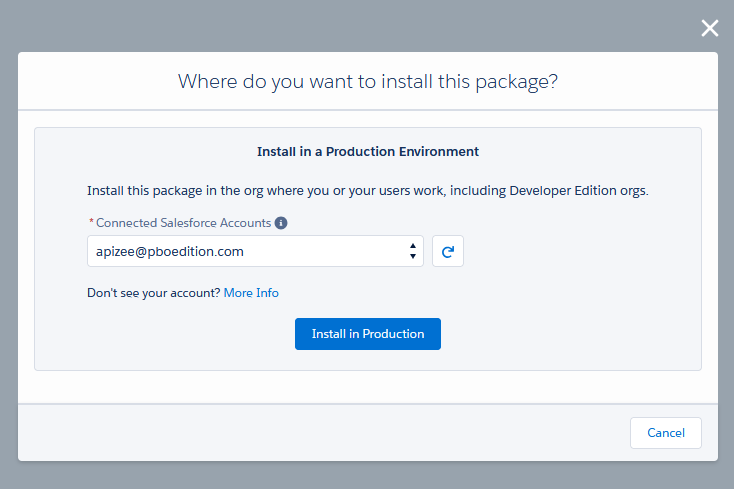
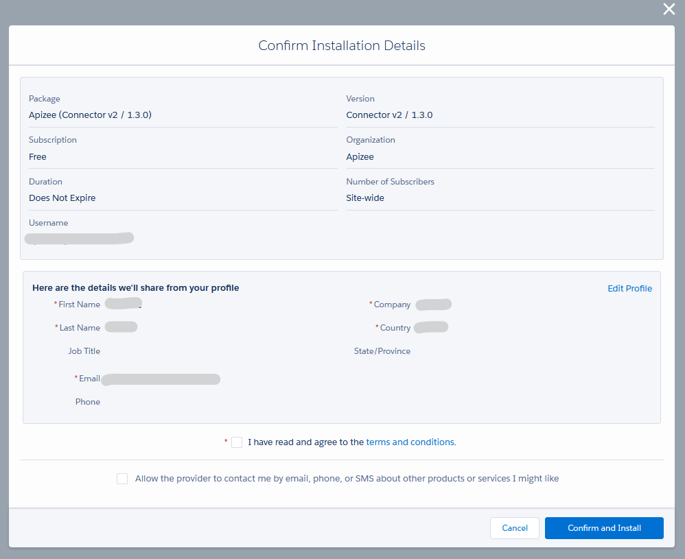

1. Go to Apizee listing page on AppExchange:[https://appexchange.salesforce.com/appxListingDetail?listingId=d4c03675-1f40-4a1a-b121-b9704fe7d50c](https://appexchange.salesforce.com/appxListingDetail?listingId=d4c03675-1f40-4a1a-b121-b9704fe7d50c). 
2. Click **Get It Now** to install the app on a production environment.
3. Select the appropriate Salesforce account to install the Apizee app on your production environment.
4. Click **Install In Production.** 
5. Check the details.
6. Click **Confirm and Install.** 

|  | The Apizee app is now installed on your production instance. |
| :--- | :--- |

1. To continue the installation, [configure your environment](configure-your-salesforce-environment.md).