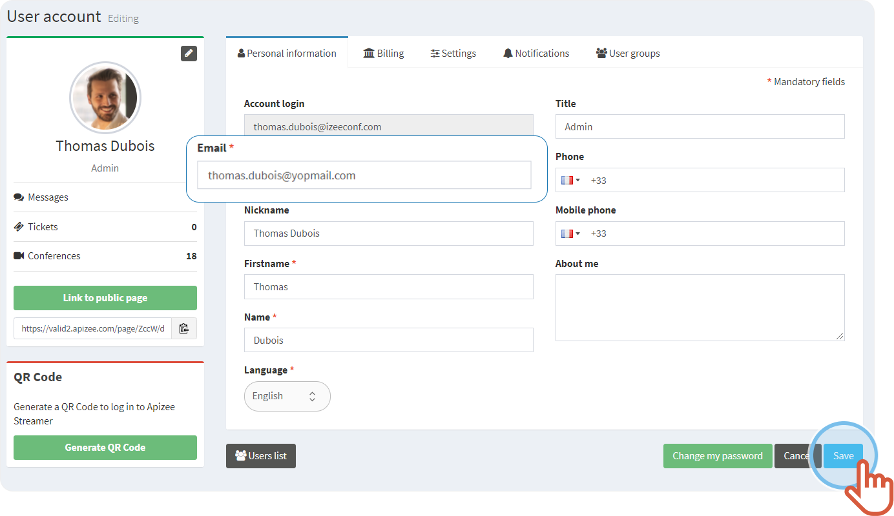

1. On the top right, click on your **Profile**.
2. Click **My account**.

    |  | The **User account** displays on the **Personal information** tab. |
    | --- | --- |
3. Change your information: **email**, **names**, **title** (your role in the company) and the **phone numbers**.
4. Click **Save**.

|  | The new information is saved. |
| --- | --- |