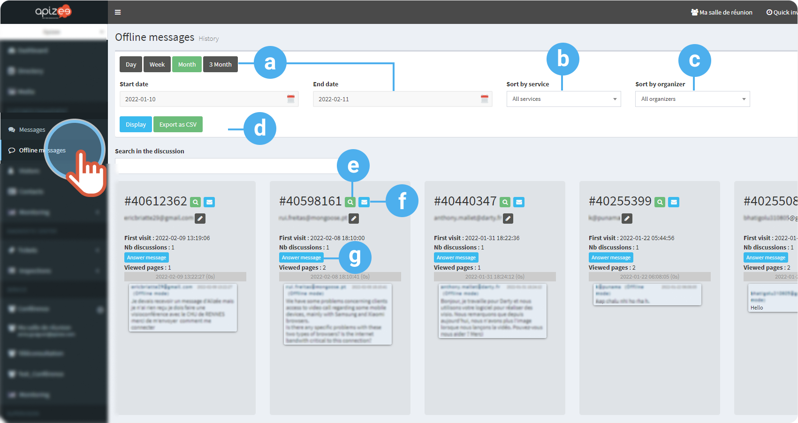
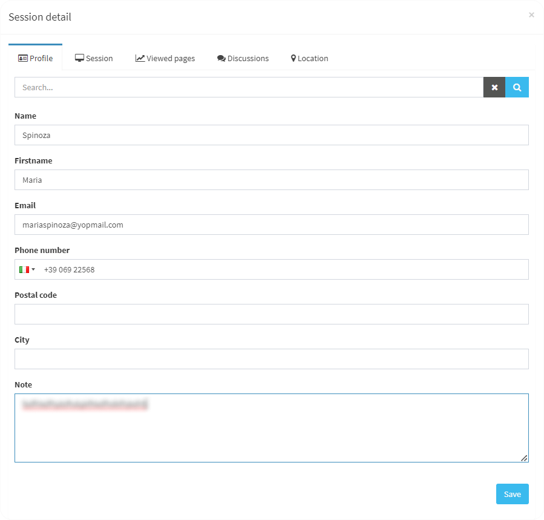
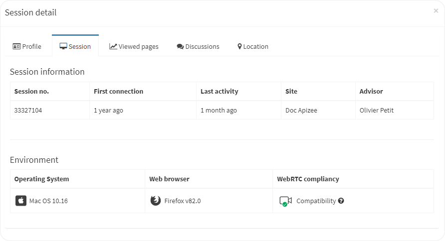
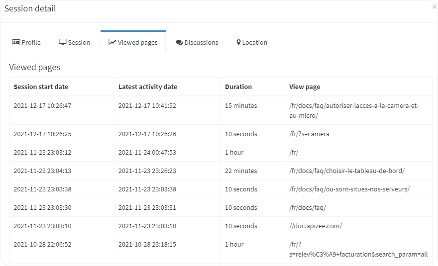
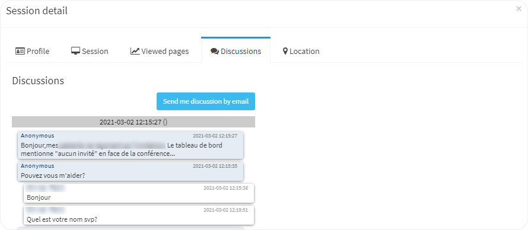
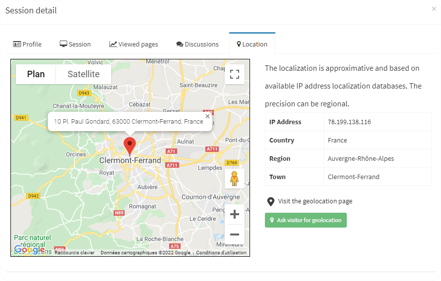
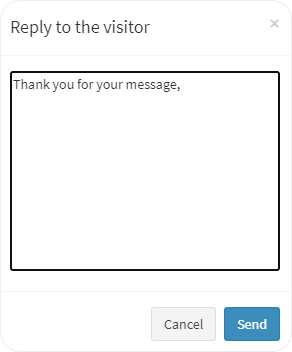

|  | You are a manager, an administrator or a supervizor.  You activated the **Offline mode** in the [chat module settings](https://doc.apizee.com/smart/project-contact-customer-relationship/configure-the-chat-module-settings). |
| --- | --- |

The offline messages are the messages left on you Website when no agent was available or out of the company [opening hours](https://doc.apizee.com/smart/project-contact-customer-relationship/configure-the-opening-hours).

1. In the left-hand menu, click **Offline messages**.
2. Choose to display a result for a given period:
    * Click a button **Day**, **Week**, **Month**…
OR
    * Choose a **starting date** then, an **ending date** in the calendar.

        |  | You can display the results for a maximum time of 3 months. |
        | --- | --- |
3. Choose to display the result for a specific **service** (Website) or **organizer** (agent).
4. In the drop-down menu, choose **All services** or one in particular.
5. Click **Display**.
6. Click **Export** to export the result of the research in a csv format.
7. Use the **search bar** to display the conversations with a specific word.

| a. | Filter for a given period | 2 options:<ul><li>Click the button corresponding to the period of time you want OR</li><li>Choose the starting and ending date in the calendar.</li></ul> |
| --- | --- | --- |
| b. | Sort by service | Display the result for a specific Website.  The entries in the Service drop-down menu depends on the company configuration.    They are the entries you configured in **Configuration** &gt; **Services management**. |
| c. | Sort by organizer (agent) | Display the result for all the agents, or one in particular. |
| d. | Export to CSV format | Export the information in order to save it locally on your computer. |
| e. | Show session details | Check the information about the visitor.    **Profile**: Enter the information of the visitor if you want to recognize him next time he visits de Website or he sends a message.  **Session**: day of the first visit of the visitor on the Website, the agent he talked to, the operating system and the WebRTC compliancy.  **Viewed pages**: List of all the consulted pages on the Website, the time spend on the page and the day.  **Discussions**: Conversation history and shared files.  **Location**: geolocation given by the IP address of the visitor.  |
| f. | Send conversation by email | Transfer the conversation on your email address.    The messages are send on the address you gave in your [profile](change-my-information.md). |
| g. | Answer message | Send an email to the visitor so you can answer to the offline message he left.  |