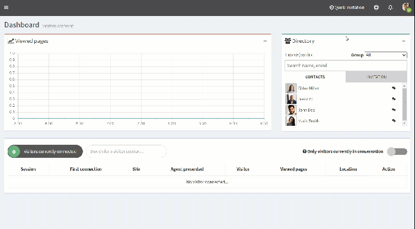

1. At the top right, click on your **Profile**.
2. Click **My account**. 
 
 
3. Click on the **Settings**tab.
4. Under **Choose the dashboard**, in the drop-down menu, choose the dashboard you want.
5. Click **Save**. 
 
 

|  | The dashboard is updated. |
| --- | --- |