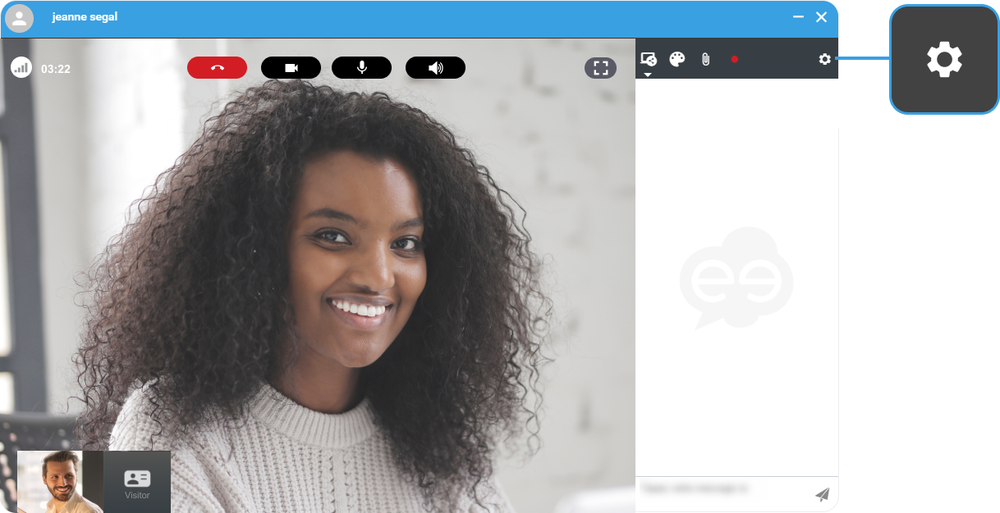
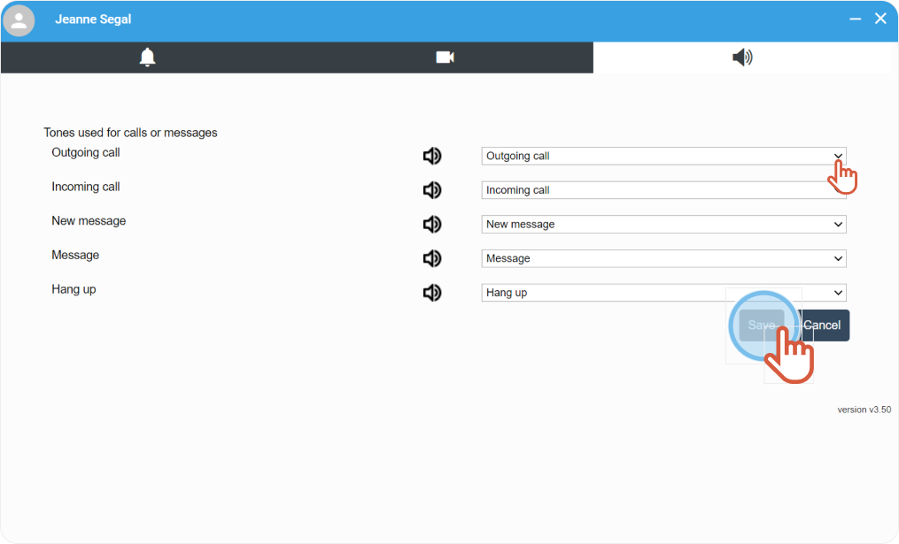
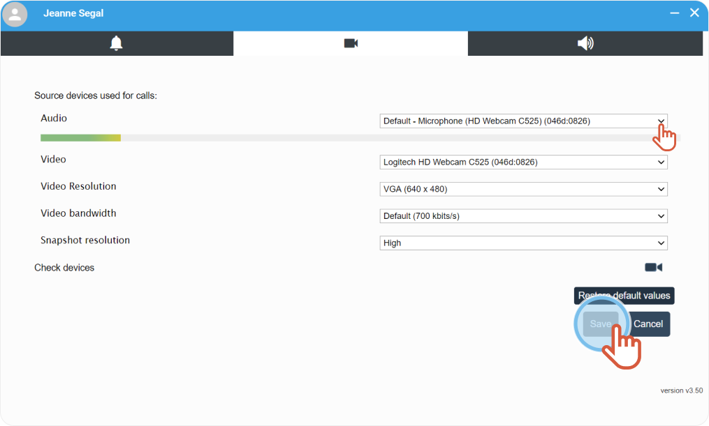
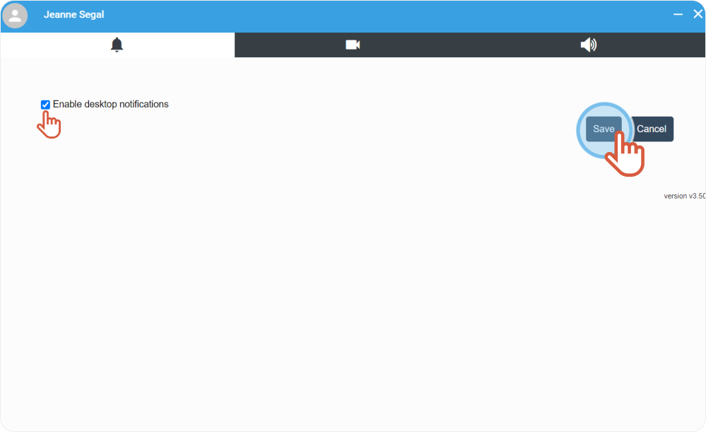

1. On the right hand-side, click the **cogwheel**to display the calling options. 
 
 
2. Click the drop-down menus to activate and deactivate the tones for the different actions displayed.
3. Click **Save**. 
 
 
4. Click the drop-down menus to select the microphone and the camera you want to use, the bandwidth and the resolution you need.
5. Click **Save**. 
 
 
6. Tick the box to **enable the notifications** and see them display on the bottom of your screen.
7. Click **Save**. 
 
 



The settings are saved.


* * *