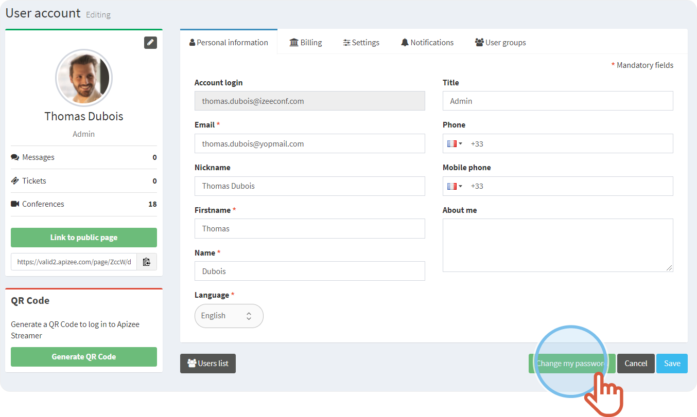

1. On the top right, click on your **Profile**.
2. Click **My account**.. 
  
 

    |  | The **User account** displays on the **Personal information tab**. |
    | --- | --- |
3. Click **Change my password**. 
 
  
 [+] [Show More](javascript:void%280%29)
 [-] [Hide](javascript:void%280%29)
 |  | Choose a **different password** that you do not use for another Website.  Mix up the characters: 12 characters, 1 uppercase, 1 lowercase, 1 digit.  Protect your password: Keep it in memory, change it regularly and do not save it in a file or on a piece of paper. |
    | --- | --- |
4. Enter the **old password** and write the **new** one.
5. Click **Save**.

|  | The new password is created. |
| --- | --- |