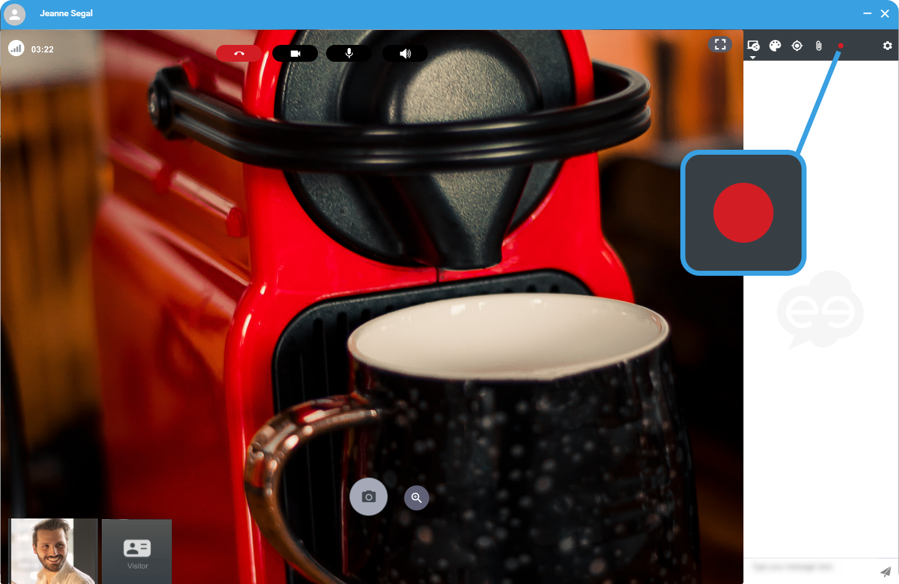

1. On the right hand-side, click the **red dot** to start the video recording. 
 
  

    

    The session reloads and starts again automatically.

    
    

    The recording starts and the participant is notified.

    
2. Click the **red dot** again to stop recording. 

    

    The recording is available on your Apizee account, in the **Messages** menu, in the [Session details](follow-the-conversations-history.md) 

    