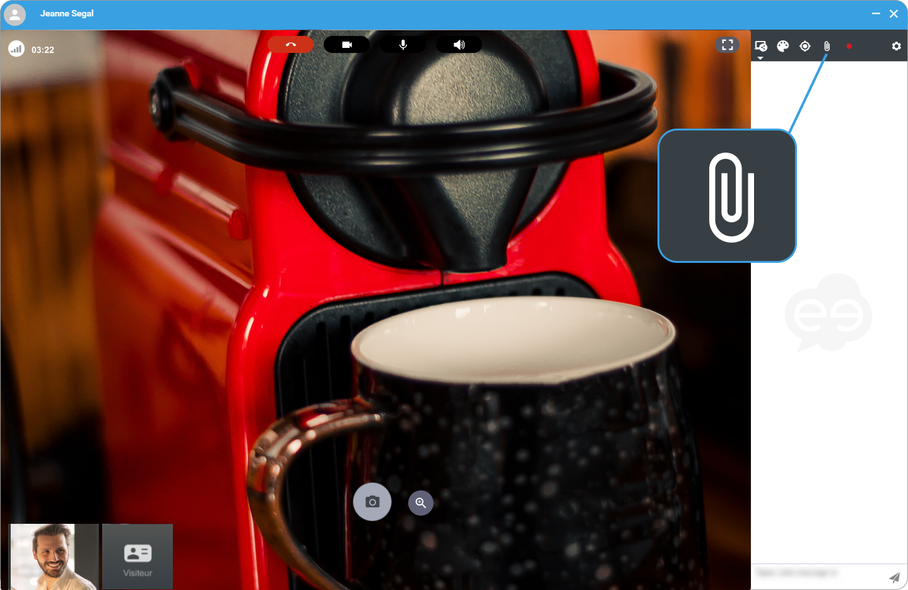
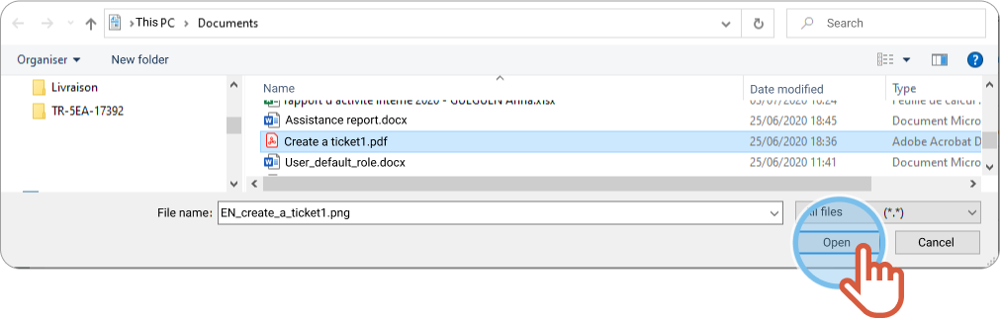

1. On the right hand-side, click the **paper clip**. 

2. Choose the file you want to share.
3. Click **Open**. 

    |  | The file charges then, it displays in the conversation window on the right. |
    | --- | --- |
4. Click the name of the file to download it.

