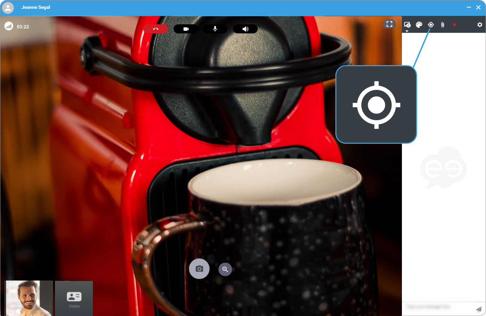

1. On the right hand-side, click the **target** to activate the pointer sharing. 
 
 
2. Click on the interlocutor video to display the marks on the screen. 
 
 
3. On the right hand-side, click the **target** again to deactivate the pointer sharing.