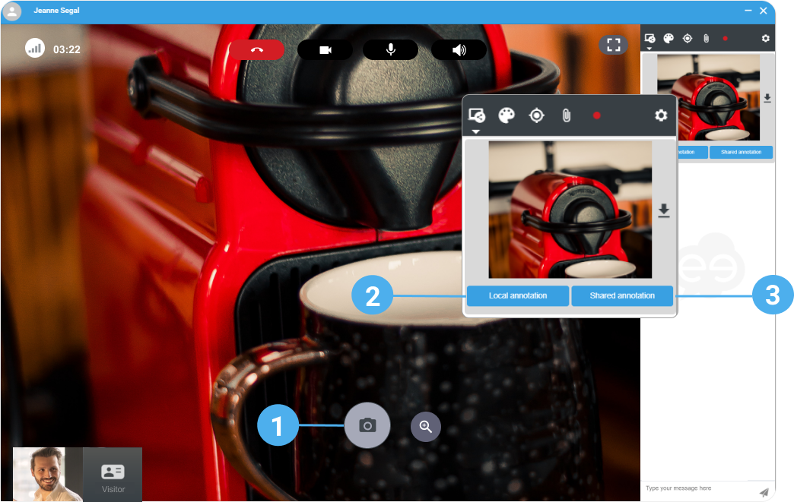
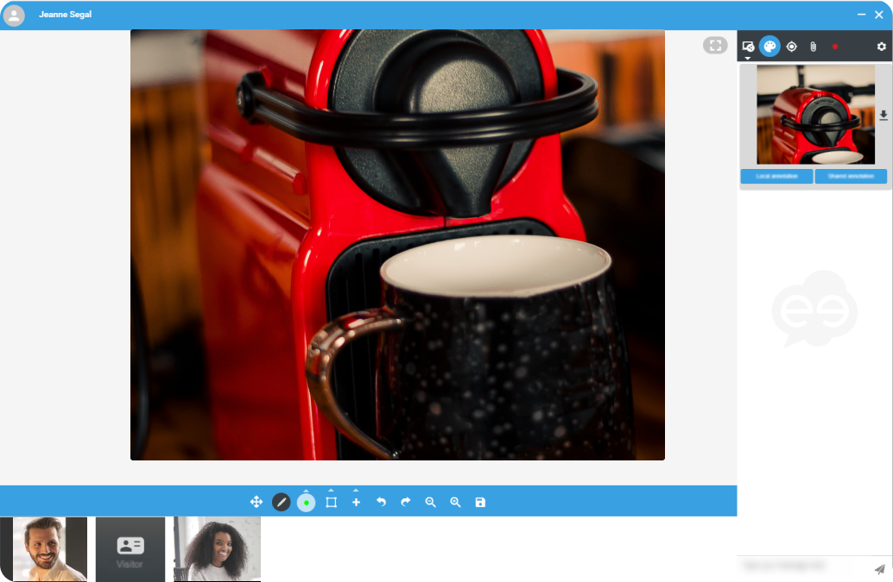
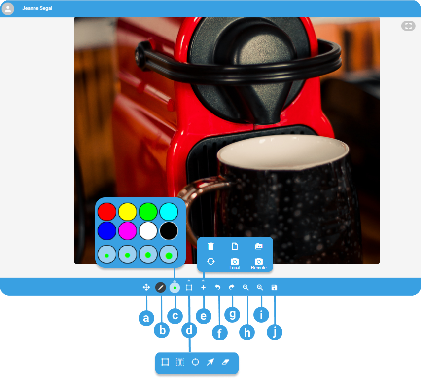

1. To take a picture of the participant video, click 
2. Click **Local annotation** to edit the picture without being seen by the participant.
3. Click **Shared annotation** to edit the picture and let the interlocutor see what you do at the same time. 
 
  

    

    The picture displays in the whiteboard.

    
 
4. Choose a **color**and a shape (**pen**, **arrow**, **circle**, **rectangle**) and draw on the picture. 
You can also annotate it with **Text**. 

    

    Do not forget to **Save** your work. Click 

    
 

| a. | Move around the picture |
| --- | --- |
| b. | Draw |
| c. | Colors and stroke size |
| d. | Shapes, text and eraser |
| e. | Delete the drawings, delete the picture, upload a new picture, rotate, take a picture with my camera, take a picture of the interlocutor video |
| f. & g. | Cancel and Restore |
| h. & i | Zoom in and Zoom out |
| j. | Save |