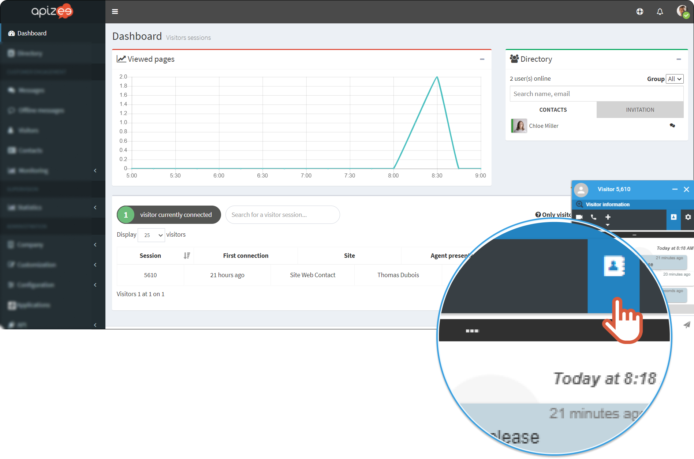
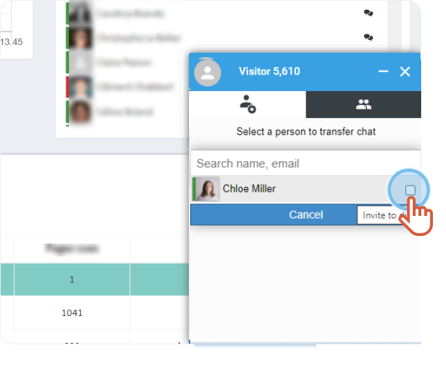
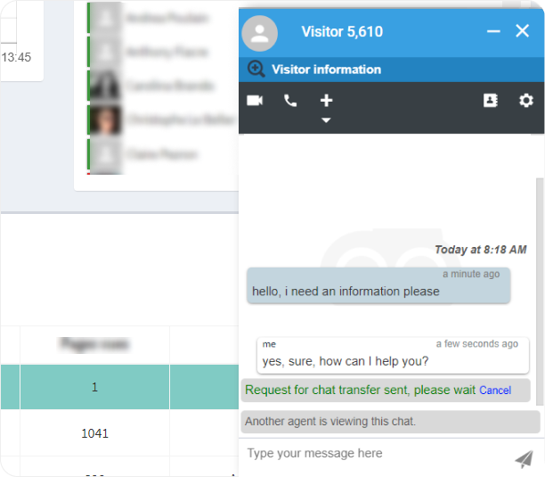

|  | A visitor sent a message to you and you want to transfer the conversation to a coworker. |
| --- | --- |

1. On the right hand-side, click the **Directory** to choose a contact.

2. Tick the box in front of the name of the person you want to transfer to conversation to.

3. Write a message to your coworker then, click **Transfer**.



The coworker receives a notification and accepts the transfer.  This message displays once the transfer is accepted: **Another agent is viewing this chat**.


