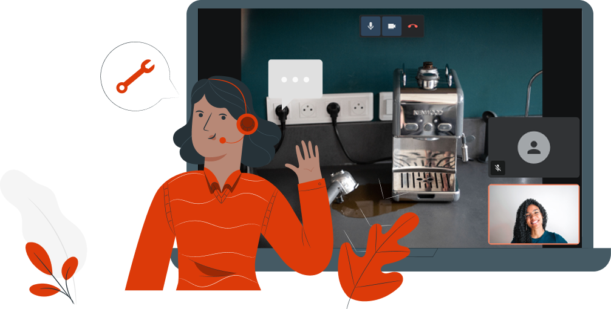

Notre solution d'assistance vidéo est conçue pour s'intégrer aux plateformes tierces et aux outils métier, CRM et plateformes de centre de contact.

Intégrée directement dans les workflows existants, elle permet aux équipes de fournir une assistance visuelle en temps réel de manière **rapide** et **efficace**.

Notre objectif est d'aider nos clients, et leurs utilisateurs, à résoudre les problèmes plus **facilement**, avec une expérience **fluide** et **intuitive**.

