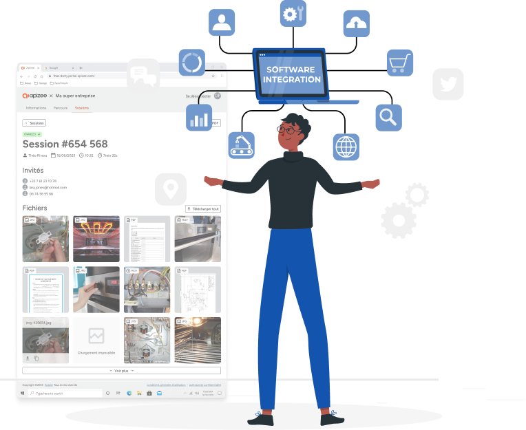

**Notre portail utilisateur facilite la gestion et la personnalisation de votre service depuis un seul endroit :**
 
* Consultez des informations claires et détaillées sur les sessions et l'utilisation
* Configurez le parcours utilisateur et choisissez les fonctionnalités disponibles
* Gérez les utilisateurs et les droits d'accès en toute simplicité
* Connectez vos outils via des webhooks pour des intégrations tierces fluides

Conçu pour une utilisation quotidienne, le portail aide les équipes à garder le contrôle, à adapter l'expérience et à s'intégrer facilement avec leurs outils existants.

