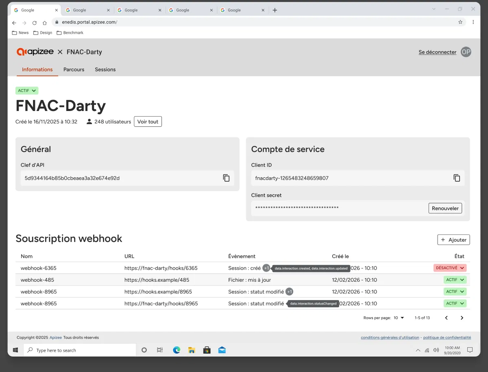


Vous disposez de la permission nécessaire pour gérer les webhooks.


Les abonnements webhook vous permettent d'envoyer automatiquement des notifications à un outil externe lorsqu'un événement se produit dans Apizee Embed.

Vous gérez les abonnements webhook depuis l'onglet **Informations**.

Pour chaque abonnement, la liste affiche le nom, l'URL de destination, les événements déclencheurs, la date de dernière mise à jour et le statut.

Cliquez sur une ligne pour ouvrir et modifier l'abonnement.

