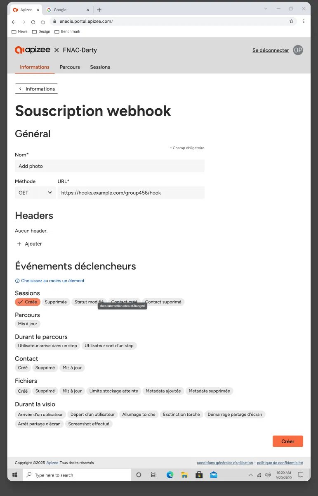

1. Sélectionnez l'onglet **Informations**.
2. Dans la section **Abonnements webhook**, cliquez sur **Ajouter**.
3. Saisissez un nom pour l'abonnement.
4. Sélectionnez une méthode HTTP.
5. Saisissez l'URL de destination.

    

    L'URL doit commencer par **https://**.

    
6. Sous **Événements déclencheurs**, sélectionnez au moins un événement.
7. Optionnel : ajoutez un ou plusieurs en-têtes sous forme de paires nom/valeur.
8. Cliquez sur **Créer**.


L'abonnement apparaît dans la liste. Un secret est généré et affiché sur la page de l'abonnement.

