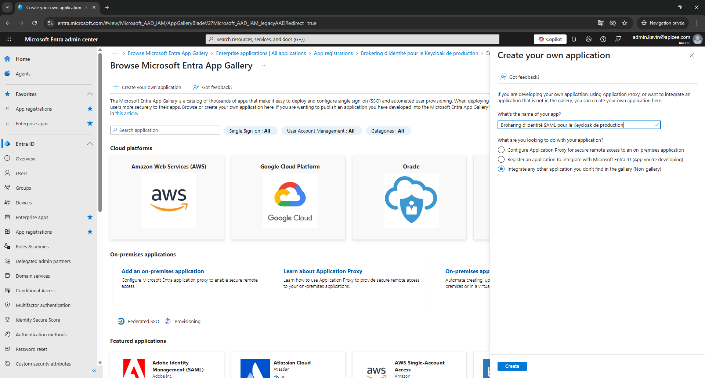
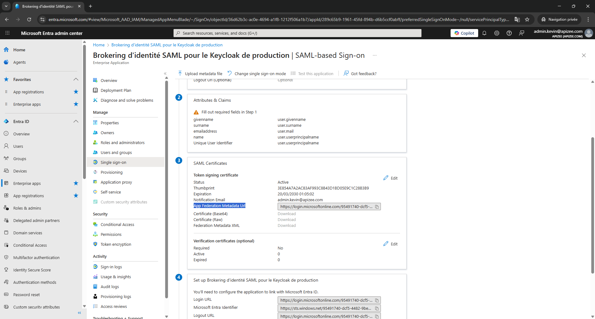

Cette procédure explique comment collecter les informations requises depuis Microsoft Entra ID pour configurer une fédération SAML avec Apizee Embed en tant que fournisseur de services externe.
 
La procédure est rédigée du point de vue de l'administrateur du tenant Microsoft Entra ID et vise à collecter les informations clés à partager avec Apizee pour mettre en place un flux de Single Sign-On.


*Vous devez disposer d'un accès administrateur au tenant Microsoft Entra ID.*
  - Vous devez être en mesure de créer une **application d'entreprise**. - Vous devez avoir la permission de configurer le **Single Sign-On (SAML)**. 


## Vue d'ensemble des informations requises
 
Au cours de la procédure, vous collecterez les informations suivantes depuis Microsoft Entra ID :
 
* L'**URL des métadonnées IdP SAML** de l'application.
* L'**identifiant de l'émetteur du fournisseur d'identité**.
* Le **point de terminaison de connexion SAML**.
* L'**attribut d'identification utilisateur** configuré.

Une fois ces informations collectées, transmettez-les au partenaire d'intégration.
 
## Créer une application d'entreprise

1. Ouvrez le **Centre d'administration Microsoft Entra**.
2. Dans le panneau de navigation de gauche, cliquez sur **Applications d'entreprise**.

3. Cliquez sur **Nouvelle application**.

4. Cliquez sur **Créer votre propre application**.
5. Saisissez un nom pour l'application.
6. Sélectionnez **Intégrer toute autre application que vous ne trouvez pas dans la galerie (hors galerie)**.
7. Cliquez sur **Créer**.


*L'application d'entreprise est créée.*
 
Vous êtes redirigé vers la page de configuration de la nouvelle application.


## Récupérer les informations clés

1. Sur la page de l'application, localisez la section **Gérer**.
2. Cliquez sur **Authentification unique**.
3. Sélectionnez **SAML** comme méthode d'authentification unique.
4. Dans la section **Certificats SAML**, localisez le champ **URL des métadonnées de fédération de l'application**.
5. Copiez l'URL complète affichée dans ce champ.

6. Enregistrez cette valeur dans votre documentation d'intégration.


*Vous disposez de l'URL des métadonnées IdP SAML.*
 
Cette URL fournit les métadonnées de fédération de votre tenant Microsoft Entra ID pour cette application.


## Vérifier l'attribut d'identification utilisateur

1. Sur la page de configuration SAML, localisez la section **Attributs et revendications**.
2. Cliquez sur **Modifier**.
3. Sélectionnez la revendication **Identificateur utilisateur unique (Name ID)**.
4. Vérifiez l'**attribut source** configuré.
5. Si nécessaire, modifiez l'attribut source pour utiliser l'attribut email de votre organisation.
6. Cliquez sur **Enregistrer**.


*L'attribut d'identification utilisateur est configuré.*


## Informations à partager avec Apizee pour configurer le SSO basé sur SAML
 
Lorsque vous avez terminé la procédure, transmettez les informations suivantes au partenaire d'intégration :

* URL des métadonnées IdP SAML
* URL de connexion
* Identifiant Microsoft Entra
* Certificat de signature SAML (Base64)
* Attribut d'identification utilisateur utilisé pour le NameID


*Ces valeurs n'exposent pas les identifiants des utilisateurs.*
 
Les métadonnées et les certificats décrivent uniquement la configuration du fournisseur d'identité nécessaire pour établir la fédération SAML.

