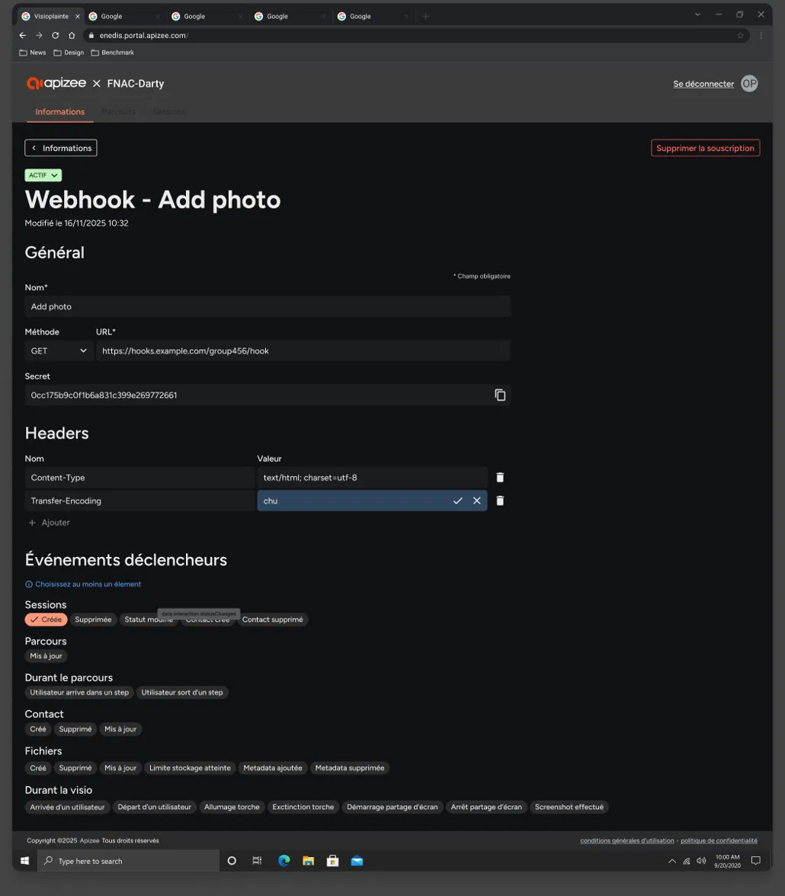

1. Select the **Information** tab.
2. In the **Webhook subscriptions** section, click the row of the subscription you want to edit. 

    |  | The subscription details display. |
    | --- | --- |
3. Edit the fields as needed:
    * For text fields (Name, URL, headers): click the field, type your changes, then click the **confirm** icon to save or the **cancel** icon to discard.
    * For the method: select a value from the dropdown.
    * For trigger events: click a chip to select or deselect it.

You cannot edit the secret. It is generated by the system and displayed for reference only.

 © Apizee. All rights reserved. 
