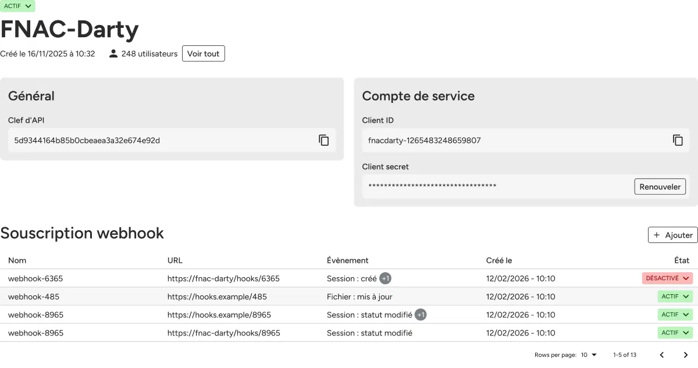

1. Select the **Information** tab.
2. In the **Webhook subscriptions** section, find the subscription.
3. In the **Status** column, click the toggle to enable or disable the subscription.


The status updates immediately. A disabled subscription stops sending notifications.


You can also change the status from the subscription detail page.
 © Apizee. All rights reserved. 
 [Send feedback](mailto:support@clickhelp.co) on this topic to Apizee.
