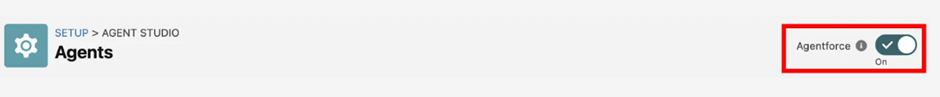
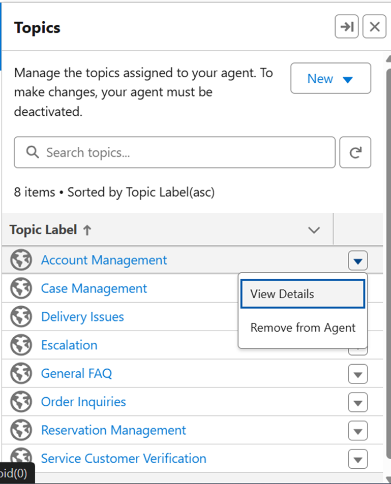
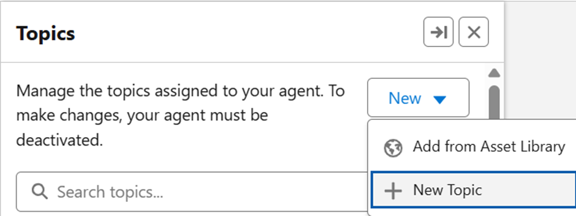

# configure-apizee-for-agentforce

##

###

|  | You need to have completed the installation on a [production](install-deploy-on-your-production-environment.md) environment before configuring your environment. |
| ------------------------------------------- | ---------------------------------------------------------------------------------------------------------------------------------------------------------------- |

###

###

This article describes the installation and configuration of the Apizee Agentforce Connector for Salesforce.

### Prerequisites

|  | <ul><li>You have System Administrator access to Salesforce.</li><li>Messaging is on in Setup > Messaging Settings.</li><li>Einstein is on in Setup > Einstein Setup.</li><li>Agentforce is on in Setup > Agent Studio > Agents.</li></ul> |
| ------------------------------------------- | ----------------------------------------------------------------------------------------------------------------------------------------------------------------------------------------------------------------------------------------- |

The package installs Salesforce flows. These flows are available as Agentforce actions. You can use them in an existing agent or in a new agent.

### Configure a New Agent

#### Enable Agentforce and Einstein User

1. In **Setup**, open **Einstein Setup** and make sure Einstein is on.
2. In **Setup**, open **Agentforce Agents** and turn on Agentforce.
3. Enable the **Agentforce (Default) Agent**. 
4. In **Setup > Users**, edit the **EinsteinServiceAgent** user.
5. Set the profile to **Einstein Agent User**.
6. Click **Save**.

#### Publish the Experience Cloud Site

1. In **Setup**, open **All Sites**.
2. Click **Builder** corresponding to the site you want to publish.
3. Click **Publish**.
4. Confirm the publication.

#### Create the Agent

1. In **Setup**, open **Agentforce Agents**.
2. Click **New Agent**.
3. Select **Agentforce Service Agent**.
4. Keep the default topics selected and click **Next**.
5.  Enter the agent information and select **EinsteinServiceAgent User.** Example :

    | **Field**                                                                        | **Value**                                                                                                                                                                                  |
    | -------------------------------------------------------------------------------- | ------------------------------------------------------------------------------------------------------------------------------------------------------------------------------------------ |
    | Name                                                                             | Agentforce Service Agent                                                                                                                                                                   |
    | API Name                                                                         | Agentforce\_Service\_Agent                                                                                                                                                                 |
    | Description                                                                      | Deliver personalized customer interactions with an autonomous AI agent. Agentforce Service Agent intelligently supports your customers with common inquiries and escalates complex issues. |
    | Role                                                                             | An AI customer service agent whose job is to help customers with support questions or other issues.                                                                                        |
    | Company                                                                          | Your company specialise on distributing internet access and internet box. Your support services help clients manage their issues with their internet connections and internet boxes.       |
    | Agent User                                                                       | EinsteinServiceAgent User                                                                                                                                                                  |
    | Keep a record of conversations with enhanced event logs to review agent behavior | disabled                                                                                                                                                                                   |
6. Click **Create**.
7. Remove all default topics except **General FAQ**. 

#### Add Custom Topic: Escalation

1. In Agentforce Builder, click **New** and select **New Topic**. 
2.  Set the topic label to **Escalation**. Example:

    | **Field**                  | **Value**                                                                                                                                                |
    | -------------------------- | -------------------------------------------------------------------------------------------------------------------------------------------------------- |
    | Topic Label                | Escalation                                                                                                                                               |
    | Classification Description | Handles requests from users who want to transfer or escalate their conversation to a live human agent.                                                   |
    | Scope                      | The agent's job is to search for an existing contact with Get Contact Apizee action before creating a case with Create Case Apizee action and escalating |
3.  Add instructions to guide escalation to a human agent. Example:

    | **Field**       | **Value**                                                                                                                                                               |
    | --------------- | ----------------------------------------------------------------------------------------------------------------------------------------------------------------------- |
    | 1st Instruction | If the user's issue is complex or you do not understand the issue asks if he would like a conversation with a live human agent during a visio call.                     |
    | 2nd Instruction | If a customer explicitly asks to transfer to a live agent, escalade                                                                                                     |
    | 3rd Instruction | When the user want to escalate, ask for his mobile phone number and use the mobile phone provided to run the Get Contact Apizee action to search for his contact record |
    | 4th Instruction | After the search for a contact record If the contact is not known in the database, run the Create Contact Apizee action to create him.                                  |
    | 5th Instruction | When you found a Contact using Get Contact Apizee, run Create Case Apizee to create a case.                                                                             |
    | 6th Instruction | When you created a Contact using Create Contact Apizee, run Create Case Apizee to create a case.                                                                        |
    | 7th Instruction | When you created a Case using Create Case Apizee, transfer to a human agent                                                                                             |
4.  Add these actions to the topic:

    \| Get Contact for AgentForce | Add the Get Contact for Agentforce Action Objective\
    This procedure explains how to add the **Get Contact for Agentforce** action to an Agentforce topic. This action searches for an existing contact by using a phone number.\
    \
     

    1. In the Agentforce Builder, select the Escalation topic.
    2. Click the This Topic’s Actions tab.
    3. Click New and select Create New Action.
    4. Select Flow as the reference action type.
    5. Select Get\_Contact\_for\_AgentForce as the reference action.
    6. Click Next.
    7. Clear the option Show loading text for this action.
    8. Set the input fields as follows:
       1. ContactPhoneNumber: Require input and collect data from user.
       2. messagingSession: Require input.
       3. ContactId: Show in conversation.
    9. Click Finish.

    \
    \
    \|  | _The Get Contact for Agentforce action is available in the Escalation topic._ |\
    \| --- | --- | | | --- | --- | | Create Contact for AgentForce | Add the Create Contact for Agentforce Action\
    This procedure explains how to add the **Create Contact for Agentforce** action to an Agentforce topic. This action creates a new contact when no existing contact is found. 

    1. In the Agentforce Builder, select the Escalation topic.
    2. Click the This Topic’s Actions tab.
    3. Click New and select Create New Action.
    4. Select Flow as the reference action type.
    5. Select Create Contact for AgentForce as the reference action.
    6. Click Next.
    7. Clear the option Show loading text for this action.
    8. Set the input fields as follows:
       * ContactFirstName: Require input and collect data from user.
       * ContactLastName: Require input and collect data from user.
       * ContactPhoneNumber: Require input and collect data from user.
       * messagingSession: Require input.
       * ContactId: Show in conversation.
    9. Click Finish.

    \
    \
    \|  | _The Create Contact for Agentforce action is available in the Escalation topic._ |\
    \| --- | --- | | | Create Case for AgentForce | Add the Create Case for Agentforce Action\
    This procedure explains how to add the **Create Case for Agentforce** action to an Agentforce topic. This action creates a Salesforce case and prepares the escalation to a human agent. 

    1. In the Agentforce Builder, select the Escalation topic.
    2. Click the This Topic’s Actions tab.
    3. Click New and select Create New Action.
    4. Select Flow as the reference action type.
    5. Select Create\_Case\_For\_AgentForce as the reference action.
    6. Click Next.
    7. Clear the option Show loading text for this action.
    8. Set the input fields as follows:
       * caseDescription: Require input.
       * caseSubject: Require input.
       * contactId: Require input.
       * contactMobilePhone: Require input.
       * messagingSession: Require input.
       * caseRecord: Show in conversation.
    9. Click Finish.

    \
    \
    \|  | _The Create Case for Agentforce action is available in the Escalation topic._ |\
    \| --- | --- | |
5. Activate the topic.

#### Publish and Route the Agent

1. In **Setup → Embedded Service Deployments**, publish the Agent Web Deployment.
2. In **Setup → Flows**, open **Route to Agent**.
3. Click **Edit Element**, set the following values in the **Set Input Values**
   * Route To : Agentforce Service Agent.
   * Agentforce Service Agent : Agentforce Service Agent
4. Save a new version and activate the flow.

#### Add the Agent to the Website

1. Open the**Setup → Experience Builder** for the site.
2. Add the **Embedded Messaging** component.
3. Publish the site.

#### Verify the Agent

1. Open the published site.
2. Click the messaging icon.
3. Start a conversation with the agent.
4. Confirm that the agent can answer questions and escalate to a human agent.

|  | 
<em>The Agentforce agent is configured and available.</em>  The AI agent can answer customer questions and escalate the conversation to a human agent when necessary.
 |
| ------------------------------------ | ---------------------------------------------------------------------------------------------------------------------------------------------------------------------------------- |
