# configure-your-salesforce-environment

##

###

|  | You need to have completed the installation on a [sandbox](install-deploy-on-a-sandbox-environment.md)or on a [production](install-deploy-on-your-production-environment.md) environment before configuring your environment. |
| ------------------------------------------- | ----------------------------------------------------------------------------------------------------------------------------------------------------------------------------------------------------------------------------- |

In this guide, you will :

* [Assign permission sets to end users](configure-your-salesforce-environment.md#h2_2046225501)
* [Enable video call statistics](configure-your-salesforce-environment.md#h1_permission_stats)
* [Enable Trusted URL](configure-your-salesforce-environment.md#h2__252222865)
* [Add the Apizee component on Object Layout](configure-your-salesforce-environment.md#h2_2130507011)
* [Assign a layout for Contact Object and Case Object (optional)](configure-your-salesforce-environment.md#h2_1398860885)
* [Apizee Connector for Salesforce Setup](configure-your-salesforce-environment.md#h2_382852360)

### Assign permission sets to end users

2 permission sets are included in package to set accessibility of Apizee package features:

* **Apizee Admin**: this permission set grants access to all Apizee app features, including the **Apizee Configuration** tab.
* **Apizee User**: this permission set grants access to Apizee app features, without the access to the **Apizee Configuration** tab. This can be assigned to end users.

Let's assign permission sets to end users:

1. Connect to the target environment as a **System Administrator.**
2. Open the **Setup** console.
3. Navigate to **Users** > **Permission Sets.** 
4. Click **Apizee Admin** permission set.

 5. Click **Manage Assignments.** 6. Click **Add Assignment.** 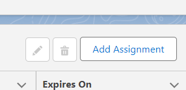 7. Check the checkboxes in front of users you want the permission set to be assigned to. 8. Click **Next.** 9. Click **Assign.**

|  | The permission sets are now assigneed to the users |
| ------------------------------------ | -------------------------------------------------- |

### Enable video call statistics

|  | <p>For some reason, the Apizee User permission set can't be installed with read/write access to Tasks>Type field.<br><br>Follow the steps below to fix this anomaly.</p> |
| ------------------------------------------------- | ------------------------------------------------------------------------------------------------------------------------------------------------------------------------ |

1. Open Salesforce and go to the **Permission Sets** section.
2. Select the **Apizee User** permission set.
3. Check if the **Task object** has read and write access to the **Type field**.
4. If the access is not available:
   1. Click **Clone** to make a copy of the Apizee User permission set.
   2. Open the new permission set.
   3. Go to **Object Settings** > **Task**.
   4. Edit the settings and add read and write access to the **Type field**.
   5. Save the changes.
5. Assign the new permission set to the applicable users.

|  | _The users have access to the Type field in the Task object._ |
| ------------------------------------ | ------------------------------------------------------------- |

### Enable Trusted URL

1. Open the **Setup** console.
2. Navigate to **Security > Trusted URLs.**
3. Click **New Trusted URL**. 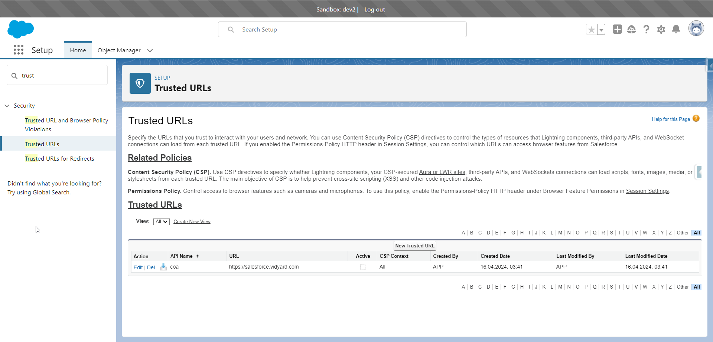
4. Fill in the information as below:
   * API Name: **Apizee**
   * URL: **\*.apizee.com**
   * Active: **checked**
5. Activate the following **CSP Directives:**
   * frame-src (iframe content)
   * img-src (images)
   * media-src (audio and video)

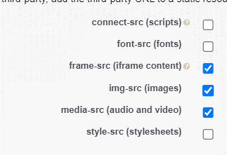 6. Click **Save** 7. Click **New Trusted URL**  8. Fill in the information as below: 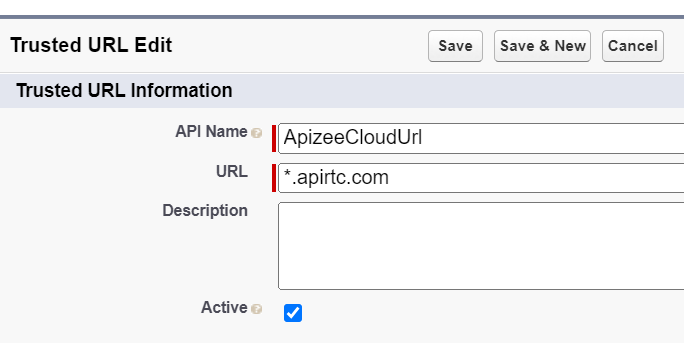

```
* API Name: **ApizeeCloudURL**
* URL : **\*.apirtc.com**
* Active: **checked**
```

9\. Activate the following **CSP Directives**

```
* frame-src (iframe content)
* img-src (images)
* media-src (audio and video)
```

 10. Click **Save**

|  | The URLs are now declared as Trusted URLs |
| ------------------------------------ | ----------------------------------------- |

###

\| Add the Apizee component on Object Layout | Add the Apizee component on Object Layout\
If you want to add component on an existing Layout page instead of using the default layout (see above).<br>

1. Open a Case or Contact record detail.
2.  Click Settings menu (circle in red below).

    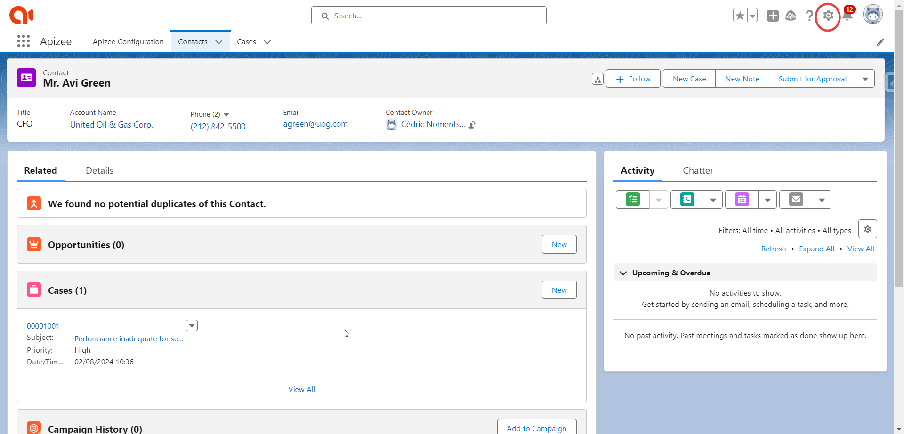

    <br>
3.  Click Edit Page.

    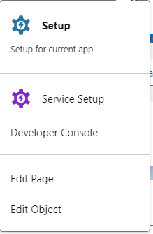
4.  In the next window, scroll down the Components list in the left panel until you see the webAgent component.

    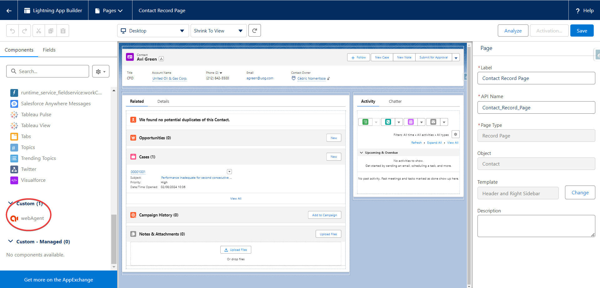
5. Drag the webAgent and drop it on one of the sections in the page layout.\
   In the following example, the webAgent component is placed in the right column of the page.\
   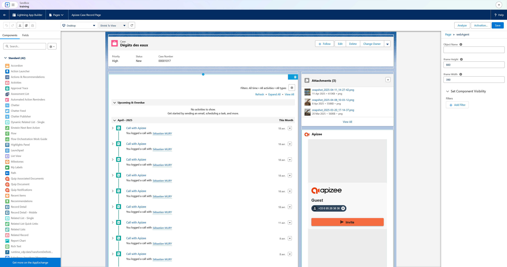<br>
6. Adjust the height and width of the component to fit the layout.
7. _(optional) If an error is displayed in the properties panel of the webAgent component, simply clear the Object Name field from any value and leave it blank._<br>
8. Click Save.

\
\
\| !\[]\(../Storage/apizee-for-salesforce-publication-admin/project-content-reuse/ok.png) | The Apizee component is now visible in the Contact or Case detail page. |\
\| :--- | :--- |\
\
\
\*Repeat the operation for both Case and Contact Layouts.\* | | --- | --- | | Assign a layout for Contact Object and Case Object (optional) | Assign a layout for Contact Object and Case Object (optional)\
\
\| !\[Information]\(../Storage/apizee-for-salesforce-publication-admin/project-content-reuse/info.png) | In this part, you will set up the default layout from Apizee instead of existing layouts.\
\
If you want to use your existing layouts, skip this step. |\
\| :--- | :--- |\
<br>

1. Connect to the target environment as a System Administrator.
2. Open the Setup console.
3. Navigate to User Interface > Lightning App Builder.
4.  Click View for Apizee Case Record Page or Apizee Contact Record Page.

    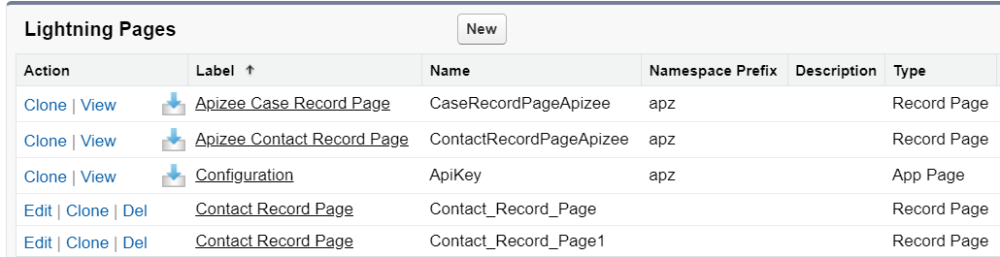

    <br>
5.  Click Activation…<br>

    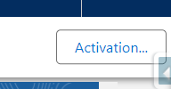

    <br>
6.  Click Assign as Org Default to set the layout for all profiles or select the App, record type and profile for which you want the layout to be available.<br>

    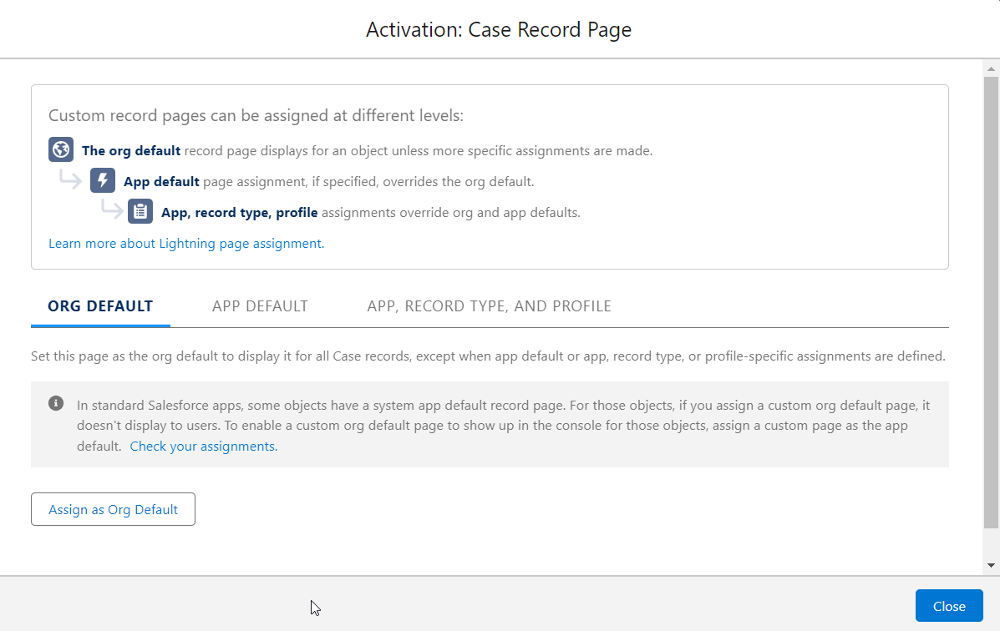
7. Click Desktop.
8. Click Next.
9. Click Save.

\
\
\| !\[]\(../Storage/apizee-for-salesforce-publication-admin/project-content-reuse/ok.png) | The layout is now available to users for the Contact or Case detail page. |\
\| :--- | :--- |\
\
\
\*Repeat the operation for both Apizee Contact Layout and Apizee Case Layout.\* |

### Add the Apizee component on Object Layout

If you want to add component on an existing Layout page instead of using the default layout (see above).

1. Open \*\*\*\* a **Case** or **Contact** record detail.
2. Click **Settings** menu (circle in red below). 
3. Click **Edit Page.** 
4. In the next window, scroll down the **Components list** in the left panel until you see the **webAgent** component. 
5. Drag the **webAgent** and drop it on one of the sections in the page layout. In the following example, the **webAgent** component is placed in the right column of the page. 
6. Adjust the **height** and **width** of the component to fit the layout.
7. _(op_ _tional) If an error is displayed in the properties panel of the webAgent component, simply clear the **Object Name** field from any value and leave it blank._
8. Click **Save**.

|  | The Apizee component is now visible in the Contact or Case detail page. |
| ------------------------------------ | ----------------------------------------------------------------------- |

Repeat the operation for both Case and Contact Layouts.

### Apizee Connector for Salesforce Setup

1. Connect to your environment with a user account which have the **Apizee User** permission set assigned.
2. Open \*\*\*\* the **App Launcher** (Lightning) or **App selector** (Classic)
3. Click **Apizee**
4. Click the **Apizee Configuration** tab 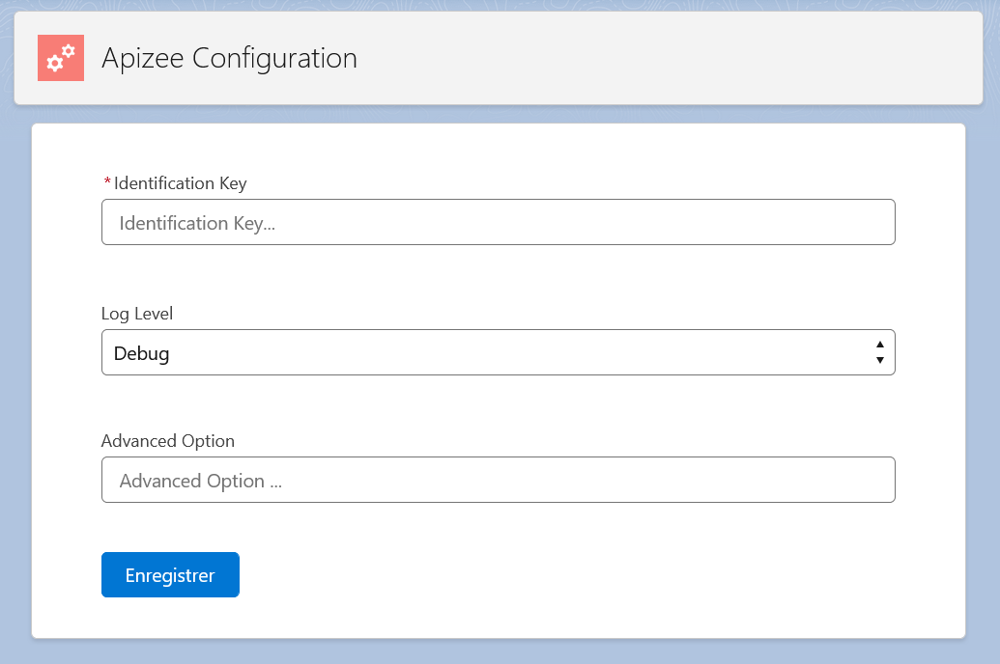
5. Fill in the **Identification Key** field with your tenant's identification key.

|  | Apizee Identification Key is provided by Apizee representatives or can be found on the [Apizee Embed portal](https://portal.apizee.com/). |
| ------------------------------------------------- | ----------------------------------------------------------------------------------------------------------------------------------------- |

The default information for the fields **Log Level** and **Advanced Option** can be kept unless instructed otherwise.

|  | The Apizee service is now configured to work in your Salesforce environement. |
| ------------------------------------ | ----------------------------------------------------------------------------- |
