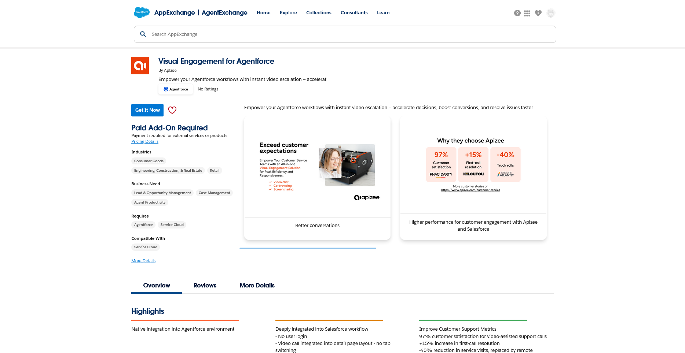
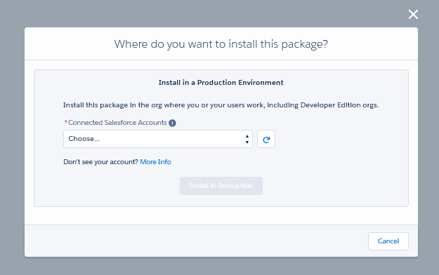
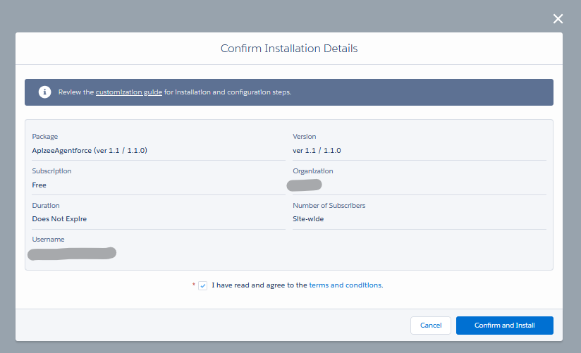
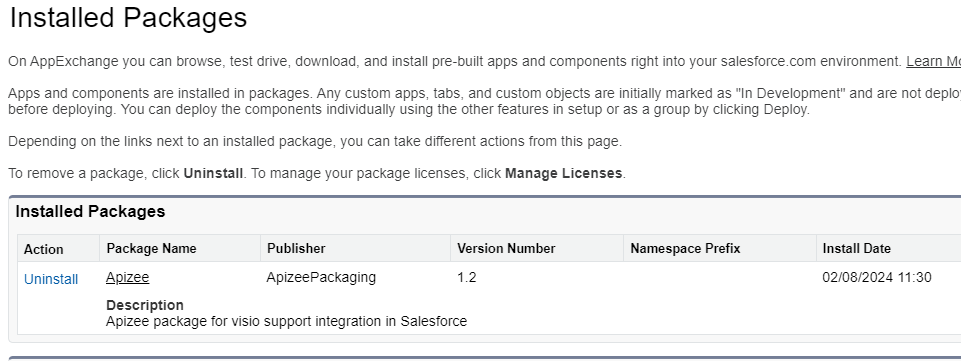

# install-and-deploy-on-a-production-environment

1. Go to Apizee listing page on AppExchange: [https://appexchange.salesforce.com/appxListingDetail?listingId=a94d3d81-9904-42c9-8145-37d26c926fe7](https://appexchange.salesforce.com/appxListingDetail?listingId=d4c03675-1f40-4a1a-b121-b9704fe7d50c)
2. Click **Get It Now** to install the app on a production environment.
3. Select the appropriate Salesforce account to install the Apizee app on your production environment.
4. Click **Install In Production.**
5. Check the details. 
6. Click **Confirm and Install.**

|  | The Apizee app is now installed on your production instance. |
| ------------------------------------ | ------------------------------------------------------------ |

|  | To continue the installation, [configure Apizee for Agentforce on your environment](configure-apizee-for-agentforce.md). |
| ------------------------------------------------- | ------------------------------------------------------------------------------------------------------------------------ |
