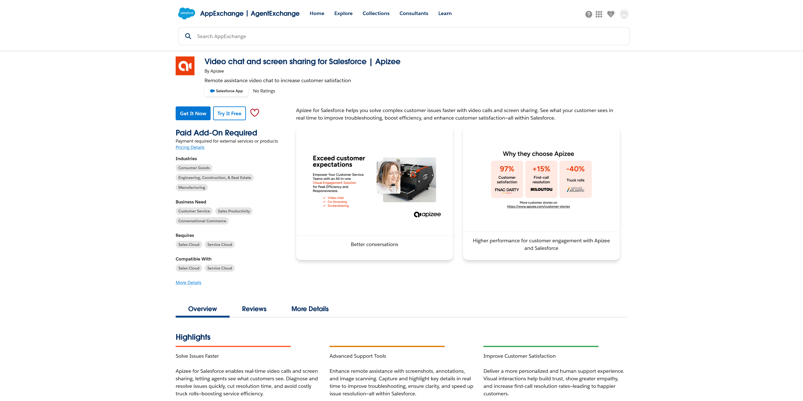
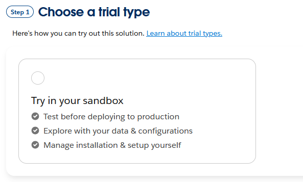
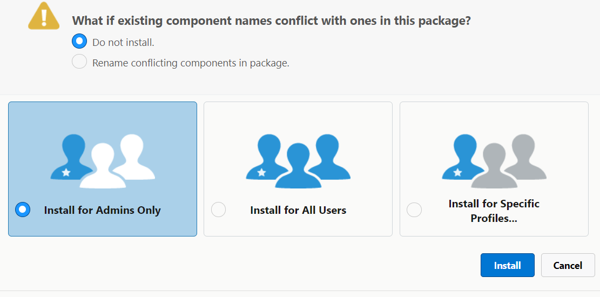
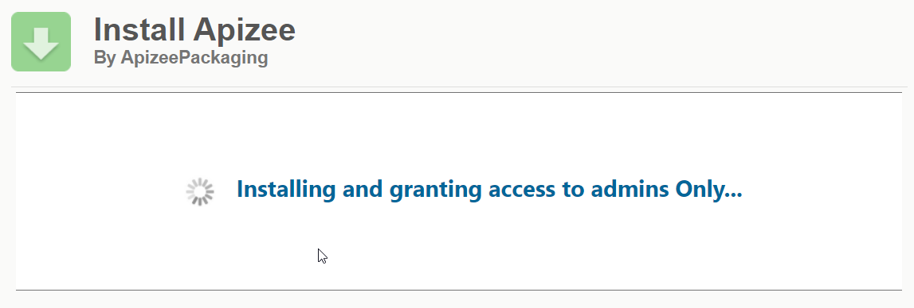
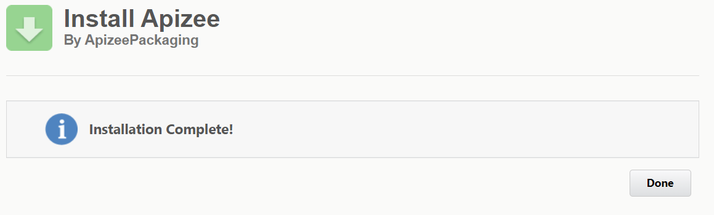

# install-deploy-on-a-sandbox-environment

1. Go to Apizee listing page on AppExchange: [https://appexchange.salesforce.com/appxListingDetail?listingId=d4c03675-1f40-4a1a-b121-b9704fe7d50c](https://appexchange.salesforce.com/appxListingDetail?listingId=d4c03675-1f40-4a1a-b121-b9704fe7d50c). 
2. Click **Try It Free** to install the app on a sandbox environment, then proceed with the app installation on your sandbox environement.
3. Click **Try in your sandbox.** 
4. Complete your details and click **Continue to Installation** button.
5. Log in on the Salesforce sandbox environment you want to install the Apizee app on.
6. Click **Install for Admins Only**.
7. Click **Install.** 



```
|  | The Apizee app is now installed on your sandbox. |
| --- | --- |
```




1. To continue the installation, [configure your environment](configure-your-salesforce-environment.md).
