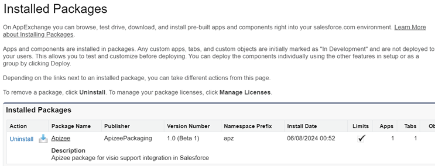

# Uninstall Apizee for Agentforce

## Preparation

* Remove Agentforce actions that use Apizee flows.
* Remove Apizee components from page layouts.

## Uninstallation

1. Log in as a System Administrator.
2. Open **Setup > Installed Packages**. 
3. Click **Uninstall** for the Apizee Agentforce package.
4. Confirm the uninstallation.

\|  | _The Apizee Agentforce package is removed from the environment._\
\
The package no longer appears in the Installed Packages list. | | --- | --- |
