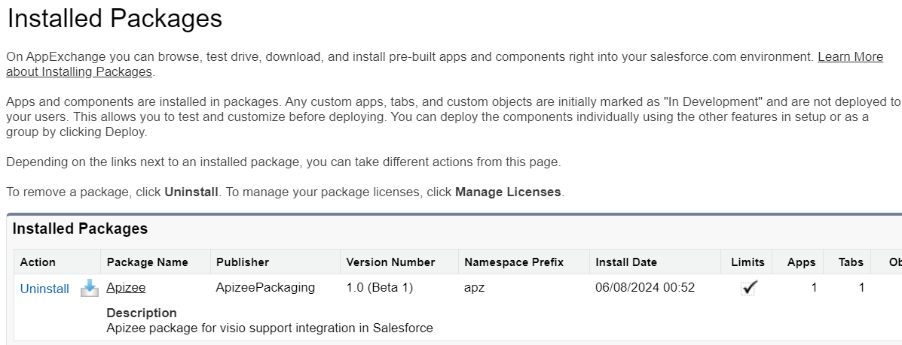
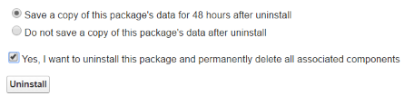

# uninstall-apizee-from-your-instance

### Preparation

To uninstall Apizee package, all setup performed after its installation need to be removed.

* Unassign Apizee permission set.
* Unassign Apizee page layout (if assigned) or remove the Apizee lightning component from layouts.

|  | If dependencies need to be removed, you will be invited to remove these dependencies before preceeding to the uninstallation. |
| ------------------------------------------- | ----------------------------------------------------------------------------------------------------------------------------- |

### Uninstall the Apizee package

1. Connect to the target environment as a **System Administrator.**
2. Open **Setup** menu.
3. Navigate to **Installed Packages.**
4. Click **Uninstall** on the Apizee package entry.
5. Choose the backup option.
6. Check the "Yes, I want to uninstall this package and permanently delete all associated components" checkbox.
7. Click **Uninstall**.

|  | The Apizee app is now removed from your Salesforce environement. |
| ------------------------------------ | ---------------------------------------------------------------- |
