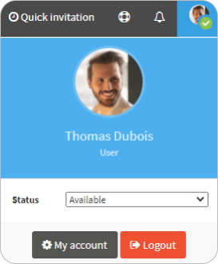

# change-my-information

1. On the top right, click on your **Profile**.
2.  Click **My account**. 

    | .png>) | The **User account** displays on the **Personal information** tab. |
    | ------------------------------------------ | ------------------------------------------------------------------ |
3. Change your information: **email**, **names**, **title** (your role in the company) and the **phone numbers**.
4. Click **Save**.

| .png>) | The new information is saved. |
| ------------------------------------------ | ----------------------------- |
