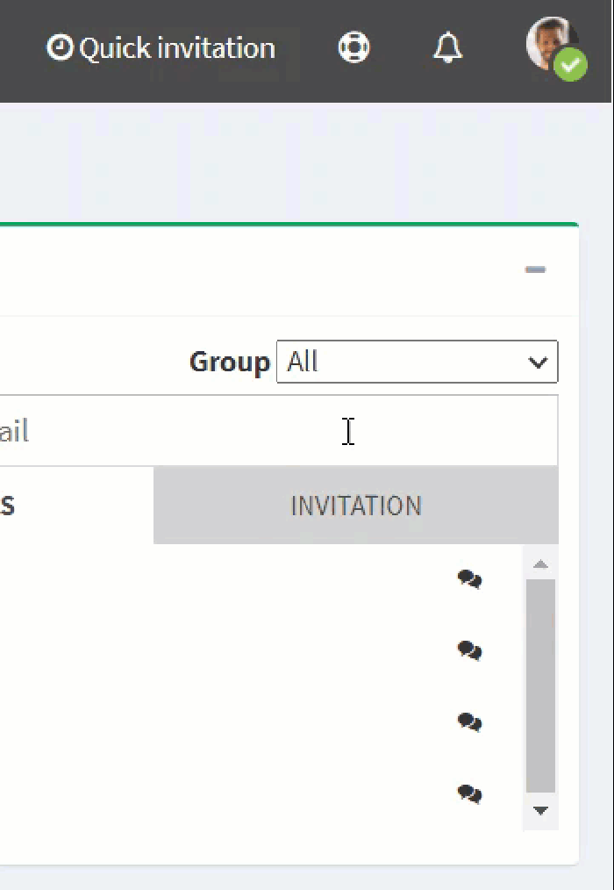

# change-my-status

1. On the top right, click on your **Profile**.
2. Choose your status in the drop-down menu:

* Available
* Busy
* Unavailable

| .png>) | The directory and the communication features are deactivated when the status is **Unavailable**. |
| ------------------------------------------------------- | ------------------------------------------------------------------------------------------------ |

| .png>) | The page reloads with the new selected status. |
| ------------------------------------------ | ---------------------------------------------- |
