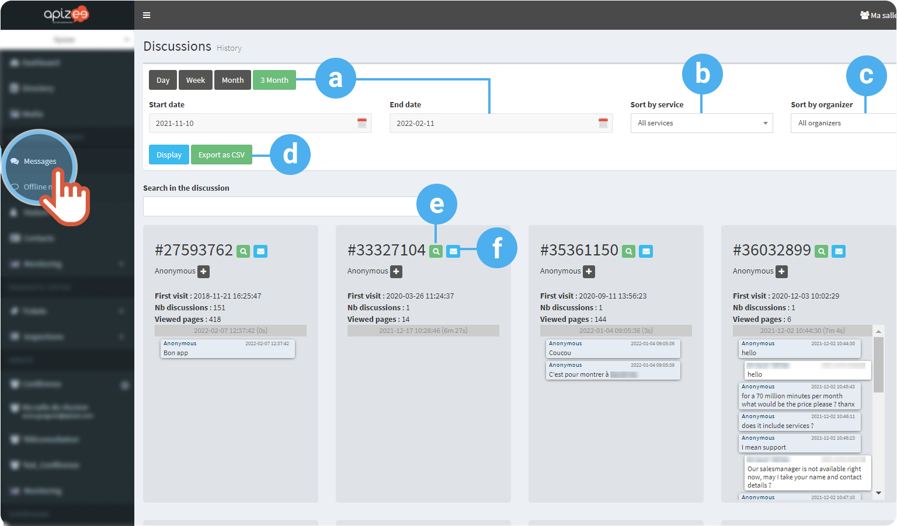

# follow-the-conversations-history

| .png>) | You are looking for a conversation you had with a visitor. |
| ------------------------------------------------- | ---------------------------------------------------------- |

1. In the left-hand menu, click **Messages**.
2. Choose to display a result for a given period:
   * Click a button **Day**, **Week**, **Month**… OR
   *   Choose a **starting date** then, an **ending date** in the calendar.

       | .png>) | You can display the results for a maximum time of 3 months. |
       | ------------------------------------------------------- | ----------------------------------------------------------- |
3. Choose to display the result for a specific **service** (Website) or **organizer** (agent).
4. In the drop-down menu, choose **All services** or one in particular.
5. Click **Display**.
6. Click **Export** to export the result of the research in a csv format.
7. Use the **search bar** to display the conversations with a specific word.

| a.                                                                                         | Filter for a given period | 
2 options:
<ul><li>Click the button corresponding to the period of time you want OR</li><li>Choose the starting and ending date in the calendar.</li></ul> |
| ------------------------------------------------------------------------------------------ | ------------------------- | ------------------------------------------------------------------------------------------------------------------------------------------------------------------- |
| b.                                                                                         | Sort by service           | Display the result for a specific Website.                                                                                                                          |
| 
 The entries in the Service drop-down menu depends on the company configuration.
 |                           |                                                                                                                                                                     |

\
\
They are the entries you configured in \*\*Configuration\*\* > \*\*Services management\*\*. | | c. | Sort by organizer (agent) | Display the result for all the agents, or one in particular. | | d. | Export to CSV format | Export the information in order to save it locally on your computer. | | e. | Show session details | Check the information about the visitor.\
\
!\[]\(../Storage/customer-engagement-user-en/project-content-reuse/Cloud-detail-icon.png)\
\
\*\*Profile\*\*: Enter the information of the visitor if you want to recognize him next time he visits de Website or he sends a message.\
!\[]\(../Storage/customer-engagement-user-en/EN-portal-session-detail-profile.png)\
\*\*Session\*\*: day of the first visit of the visitor on the Website, the agent he talked to, the operating system and the WebRTC compliancy.\
!\[]\(../Storage/customer-engagement-user-en/EN-portal-session-detail-info-environment.png)\
\*\*Viewed pages\*\*: List of all the consulted pages on the Website, the time spend on the page and the day.\
!\[]\(../Storage/customer-engagement-user-en/EN-portal-session-detail-viewed-pages.png)\
\*\*Discussions\*\*: Conversation history and shared files.\
!\[]\(../Storage/customer-engagement-user-en/EN-portal-session-detail-conversation.png)\
\*\*Location\*\*: geolocation given by the IP address of the visitor.\
!\[]\(../Storage/customer-engagement-user-en/EN-portal-session-detail-location.png) | | f. | Send conversation by email | Transfer the conversation on your email address.\
\
!\[]\(../Storage/customer-engagement-user-en/project-content-reuse/Cloud-message-icon.png)\
\
The messages are send on the address you gave in your \[profile]\(change-my-information.md). |
