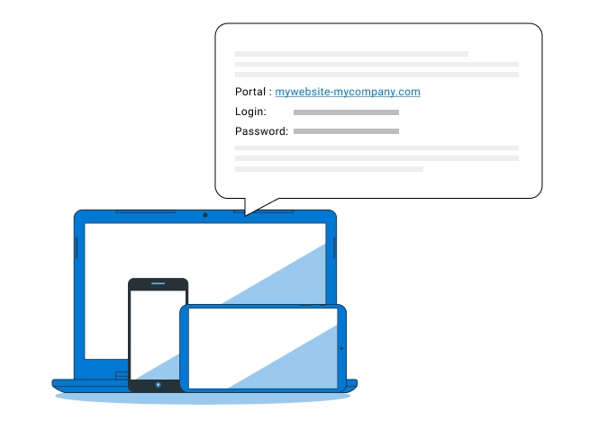
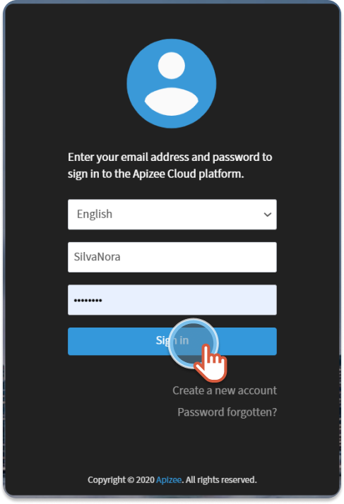
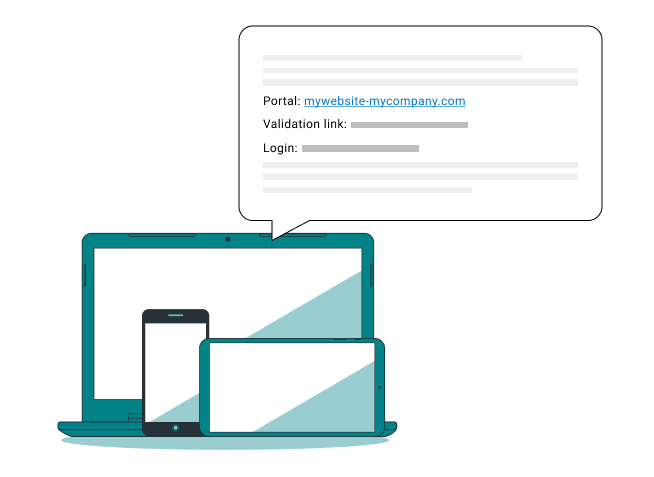
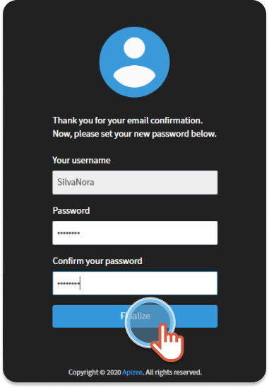

# log-in-to-the-apizee-portal-for-the-first-time

| .png>) | 
You want an Apizee account and you received a message with: 
<ul><li><a href="log-in-to-the-apizee-portal-for-the-first-time.md#A login and a password">A login and a password</a> Or</li><li><a href="log-in-to-the-apizee-portal-for-the-first-time.md#A validation link and a login">A validation link and a login</a></li></ul> |
| ------------------------------------------------- | ----------------------------------------------------------------------------------------------------------------------------------------------------------------------------------------------------------------------------------------------------------------------------------------------------------------------------------------------- |

### A login and a password

| .png>) | 
In the following procedure, we imply that the administrator sent a message to the new user with all the information. Of course, and for security reasons, it is up to the administrator to choose the way to communicate the link, the login and the password.
 |
| ------------------------------------------- | ------------------------------------------------------------------------------------------------------------------------------------------------------------------------------------------------------------------------------------------------------------------------ |

1. In the message, click the **link**.
2. Enter the login and the password given by the administrator.
3. Click **Sign in**.

| .png>) | You are logged in to your account. |
| ------------------------------------------ | ---------------------------------- |

## A validation link and a login

1. In the message, click **Account validation link**.
2.  Enter your password twice.

    | .png>) | 
Choose a <strong>different password</strong> that you do not use for another Website.  Mix up the characters: 12 characters, 1 uppercase, 1 lowercase, 1 digit, 1 special character.  Protect your password: Keep it in memory, change it regularly and do not save it in a file or on a piece of paper.
 |
    | ------------------------------------------- | --------------------------------------------------------------------------------------------------------------------------------------------------------------------------------------------------------------------------------------------------------------------------------------------------------------------------- |
3. Click **Finalize**.

| .png>) | You are logged in to your account. |
| ------------------------------------------ | ---------------------------------- |
