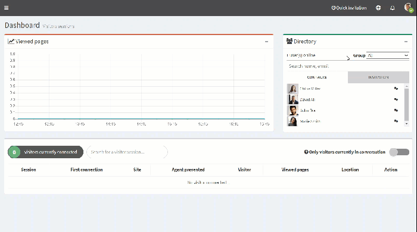

# portal-change-my-language

1. On the top right, click on your **Profile**.
2. Click **My account**.

 3. Under **Language**, click the language you want in the drop-down menu. 4. Click **Save**.

| .png>) | The page reloads with the selected language. |
| ------------------------------------------ | -------------------------------------------- |

