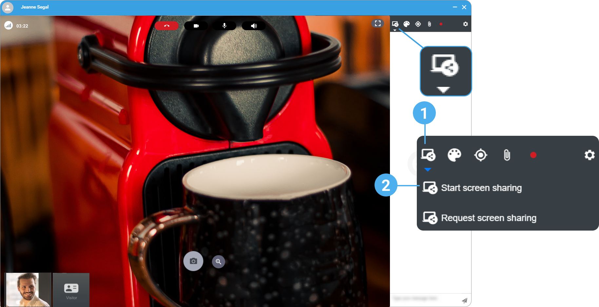

# share-a-screen

1. On the right hand-side, click the **Screen sharing** button.
2. Click **Start screen sharing** if you want to share your own screen.

 3. Choose the screen you want to share. 4. If you want to share a video and you want the participants to hear the video sound, tick the box **Share audio**. This option may depend on your Web browser. 5. Click **Share**.

.png>) 6. Click **Request screen sharing** if you want your interlocutor to share his screen. A sharing request is sent to the participant. The participant screen displays when the request is accepted.

```
|  | This option is available on computers only. |
| --- | --- |
```

7\. To stop the screen sharing, click the **Screen sharing** button again.
