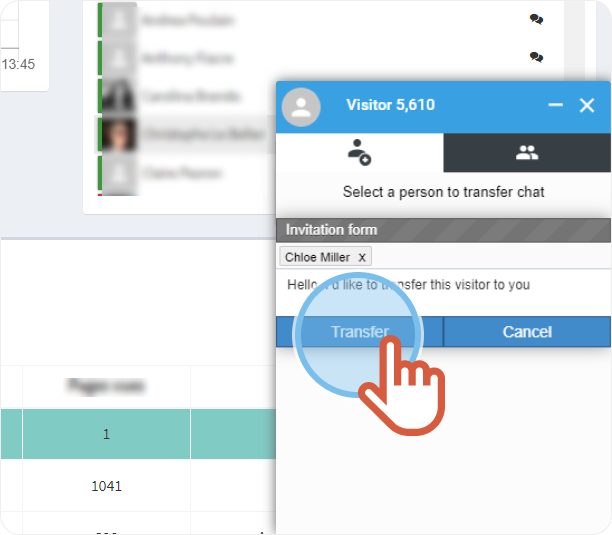

# transfer-a-conversation-to-a-coworker

| .png>) | A visitor sent a message to you and you want to transfer the conversation to a coworker. |
| ------------------------------------------------- | ---------------------------------------------------------------------------------------- |

1. On the right hand-side, click the **Directory** to choose a contact.

 2. Tick the box in front of the name of the person you want to transfer to conversation to.

 3. Write a message to your coworker then, click **Transfer**.

| .png>) | 
The coworker receives a notification and accepts the transfer.  This message displays once the transfer is accepted: <strong>Another agent is viewing this chat</strong>.
 |
| ------------------------------------------ | -------------------------------------------------------------------------------------------------------------------------------------------------------------------------------------- |

