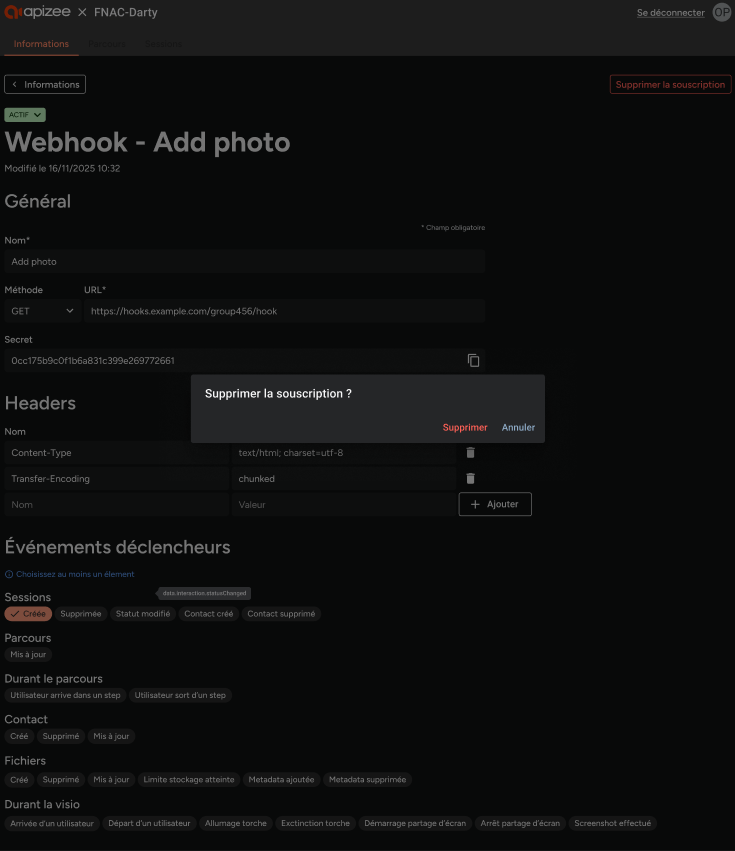

# delete-webhook-subscription

1. Select the **Information** tab.
2.  In the **Webhook subscriptions** section, click the row of the subscription you want to delete.

    |   | The subscription details display. |
    | - | --------------------------------- |
3. Click **Delete**.
4. In the confirmation dialog, click **Delete** to confirm.


The subscription is permanently deleted and no longer appears in the list.


© Apizee. All rights reserved. [Send feedback](mailto:support@clickhelp.co) on this topic to Apizee.
