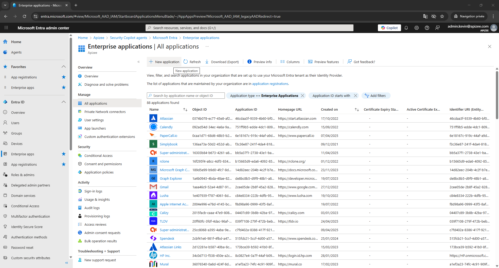
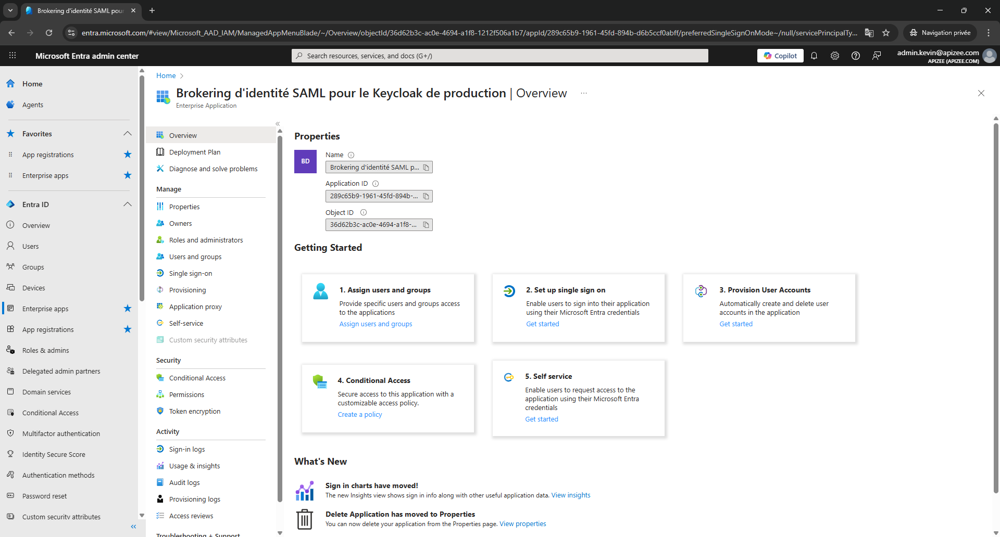

# sso-retrieve-microsoft-entra-id-data-required-for-saml-federation

This procedure explains how to collect the information required from Microsoft Entra ID to configure a SAML federation with Apizee Embed as an external service provider.

The procedure is written from the point of view of the Microsoft Entra ID tenant administrator and aims at collecting key informations to be shared with Apizee to set up a Single-Sign on flow.


_You must have administrator access to the Microsoft Entra ID tenant._

* You must be able to create an **Enterprise application**. - You must have permission to configure **Single Sign-On (SAML)**.


### Overview of required information

During the procedure, you will collect the following information from Microsoft Entra ID:

* The **SAML IdP metadata URL** of the application.
* The **Identity Provider issuer identifier**.
* The **SAML login endpoint**.
* The configured **user identifier attribute**.

After you collect this information, send it to the integration partner.

### Create an enterprise application

1. Open the **Microsoft Entra admin center**.
2. In the left navigation panel, click **Enterprise applications**. 
3. Click **New application**. 
4. Click **Create your own application**.
5. Enter a name for the application.
6. Select **Integrate any other application you don't find in the gallery (Non-gallery)**.
7. Click **Create**. 


_The enterprise application is created._

You are redirected to the configuration page of the new application.


### Retrieve key informations

1. In the application page, locate the **Manage** section.
2. Click **Single sign-on**.
3. Select **SAML** as the single sign-on method.
4. In the **SAML Certificates** section, locate the field **App Federation Metadata Url**.
5. Copy the complete URL displayed in this field. 
6. Save this value in your integration documentation.


_You have the SAML IdP metadata URL._

This URL provides the federation metadata of your Microsoft Entra ID tenant for this application.


### Verify the user identifier attribute

1. In the SAML configuration page, locate the section **Attributes & Claims**.
2. Click **Edit**.
3. Select the claim **Unique User Identifier (Name ID)**.
4. Check the configured **Source attribute**.
5. If necessary, change the source attribute to the email attribute used by your organization.
6. Click **Save**.


_The user identifier attribute is configured._


### Information to share with Apizee to set up SAML-based SSO

When you complete the procedure, send the following information to the integration partner:

* SAML IdP metadata URL
* Login URL
* Microsoft Entra Identifier
* SAML signing certificate (Base64)
* User identifier attribute used for NameID


_These values do not expose user credentials._

The metadata and certificates only describe the identity provider configuration required to establish the SAML federation.


© Apizee. All rights reserved. [Send feedback](mailto:support@clickhelp.co) on this topic to Apizee.
