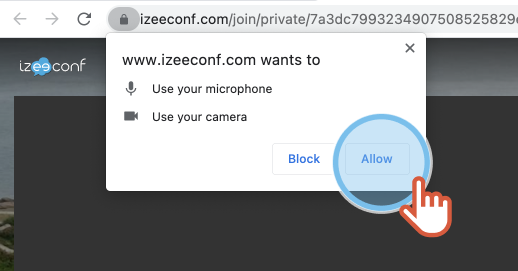

# how-to-check-my-microphone-and-camera-before-an-appointment

**You have an appointment and you want to check your devices before the session starts?**

1.  Click the link in the invitation message you received.

    |   | The video conference page opens. |
    | - | -------------------------------- |
2. Enter your **name**.
3. **Allow** the web browser to use your microphone and camera. If you do not allow the access, you will not be able to check if they work properly.

 4. Check your microphone and camera. 5. When you are ready, click **Join**!
