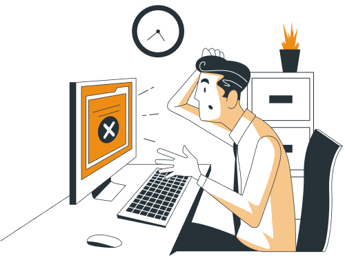
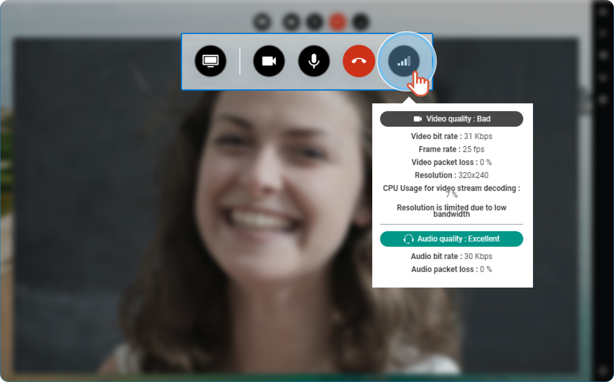

# Video or audio keeps cutting out


A bad network connection can influence the quality of the audio and the video.


1. From the call bar, click 

2. If the connection is bad, follow the steps below:

    | You are on a mobile phone |  | You are on a computer |
    | --- | :---: | --- |
    | Activate the WiFi on your mobile phone and continue the conference as long as the WiFi network is stable. |  | Connect the computer to the modem with an Ethernet cable. |
    | Still having an issue? |  | Still having an issue? |
    | Deactivate the camera and continue with the audio only. |  | Deactivate the camera and continue with the audio only. |
