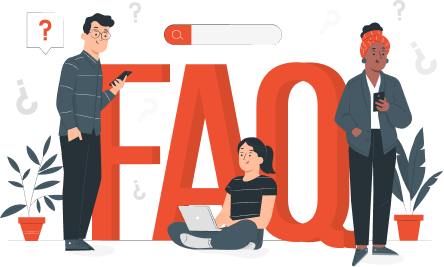

Here are the **Frequently Asked Questions**:

* [About Apizee solutions](faq-about-apizee-solutions.md)
* [Are the conferences confidential?](the-conferences-are-they-confidential.md)
* [Where are the servers?](/apizeelegacy-docs/faq/platform/where-are-the-servers)
* [How to check my microphone and camera before an appointment?](how-to-check-my-microphone-and-camera-before-an-appointment.md)
* [What language is available?](/apizeelegacy-docs/faq/platform/what-language-is-available)
* [How can I transfer the video session from my mobile phone to my computer?](how-can-i-transfer-the-video-session-from-my-mobile-phone-to-my-computer.md)
* [How can I switch from dark to light mode?](/apizeelegacy-docs/faq/platform/how-can-i-switch-from-dark-to-light-mode)
* [I do not manage to join the session](i-do-not-manage-to-join-the-session.md)
* [People cannot see me](people-cannot-see-me.md)
* [People cannot hear me](people-cannot-hear-me.md)
* [The video and the audio cut off](the-video-and-the-audio-cut-off.md)
* [The audio is strange](the-audio-is-strange.md)
* [I do not have the sound notifications](i-do-not-have-the-sound-notifications.md)
* [I forgot my password, can I reset it?](/apizeelegacy-docs/faq/platform/i-forgot-my-password-can-i-reset-it)
* [Allow the Web browser to access the camera and the microphone on my computer](allow-the-web-browser-to-access-the-camera-and-the-microphone-on-my-computer.md)
* [I want to change my subscription](/apizeelegacy-docs/faq/platform/i-want-to-change-my-subscription)
* [I cannot add a new user to my company](/apizeelegacy-docs/faq/platform/i-cannot-add-a-new-user-to-my-company)
* [How to contact the Support Team and follow my requests?](/apizeelegacy-docs/faq/platform/how-to-contact-the-support-team-and-follow-my-requests)
