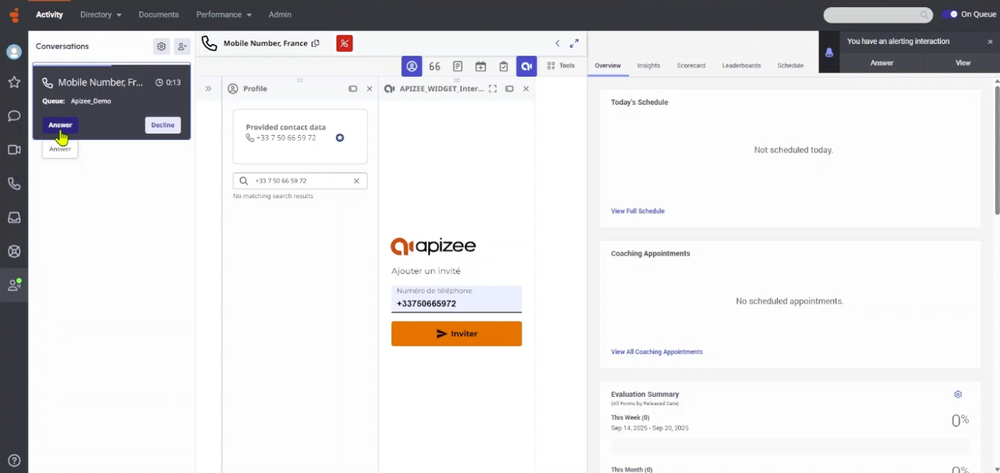

# getting-started-apizee-genesys

##

The Apizee connector is an add-on for Genesys. It helps customer support personnel start video sessions inside Genesys.


_Use this connector to give visual help to the user during support calls._

**Target Users:** Support agents who use Genesys. **Main Benefit:** When phone, email, or chat is not enough, video helps solve problems faster. **Benefits:** Faster resolution, reduced escalation and enhanced tracking.


### Quick Start Guide


Before you start, make sure:

* The Apizee connector is installed.- You can access Genesys with a user account authorized to use Apizee.- Your Internet connection is stable.- Your device has camera and microphone access enabled.


1. **Log in to Genesys**Enter your credentials and access the platform.​
2. **Start the video session** When an incoming call is assigned to you, the Apizee widget is available. The customer's phone number is automatically filled into the Apizee widget interface. Click **Invite**.



```
|  | Note that the phone number field is pre-filled with the Contact's mobile phone number associated with the current call.
```

To send an invitation for a video call to a different number, please update the phone number in the side panel or later in the Apizee platform. | | --- | --- | 3. **log in to the Apizee solution**If you are not already logged in the Apizee solution, fill in your user name and password then click **Sign-In**.

!\[]\(.gitbook/assets/Log in Apizee console.png)

```
|  | The SSO authentification option is compatible with the Apizee for Genesys app. |
| --- | --- |
```

4\. **Send invitation** You are now ready to send an invitation to join de video call to your guest: click **Send Invitation**.

&#x20;5\. **Allow access to camera and microphone** Accept the prompt in your browser.

```
|  | *If no prompt appears, check your browser's settings.* |
| --- | --- |
```

6\. **The video call begin** In the Apizee solution, you will be automatically redirected to the detail page of the newly created **ticket**. Eventually, the guest will click on the link they received via SMS and begin the video call. You will then be prompted with a call signal.&#x20;

 7. **Assist the user**Discover all the available visual engagement actions accessible through your Genesys platform in the dedicated article: ➡️ [Visual engagement actions overview](../video-assistance/help-desk/actions-during-the-video-assistance/actions-overview.md) 8. **After the video call** After the call, the agent can track their interaction with the customer in the details of an interaction, in the "Participant Data" section.

The information available for each interaction : 1. The assigned agent 2. Whether there was an Apizee video call 3. The URL of the detailed Apizee report for the video call 4. The duration

The detailed Apizee report allows the agent to view a summary of the video exchanges, included all :

* Photos
* Annotated photos
* Shared files
* Video recording


### FAQ and Troubleshooting

**Q1: What if I do not receive the call signal?**

* Ensure that you are logged in with an account that has the necessary permissions.
* Refresh the page and verify your Internet connection.
* If the issue persists, contact your administrator.

**Q2: My browser is not prompting for camera/microphone access. What should I do?**

* Check your browser’s security settings to ensure access is allowed for the Apizee site.
* Restart your browser and try again.

**Q3: What if the audio or video quality is poor?**

* Confirm that you are on a stable network.
* Close background applications that may be using bandwidth.
* For prolonged issues, contact technical support.

### Tips

* For improved session quality, close unnecessary background applications that could consume network resources or CPU power.
* Use a quiet, well-lit environment for optimal video quality during calls with clients.
