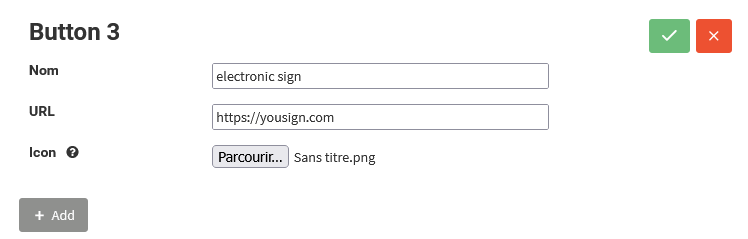
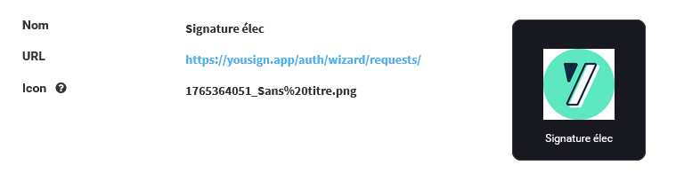

# update-or-remove-custom-action-from-organizer-panel


* _At least one custom action exists._ - _You are connected as a Cloud Portal Administrator._ - _You are on: **Configuration → During the session → Custom action**._


### To modify a custom action:

1. Find the custom action and click the **Edit (pencil)** icon.
2. Edit the name, URL, or logo. Same rules apply as for creation.



1. Click the **green check**icon to save.
   * Changes are applied, fields become read-only.

 2. Click the **red cancel** icon to cancel.

```
* A popup lets you confirm or discard changes.
```


Modified actions are visible after page refresh


### To delete a custom action:

1. Click the **Delete (trash)** icon.
2. Confirm in the popup.
3. The action is removed and a success message appears.


_Deleted actions disappear._

