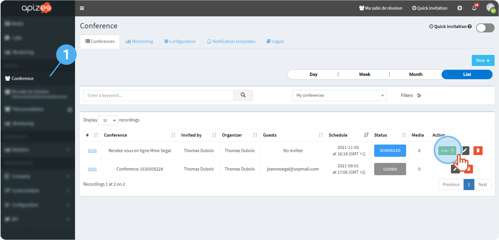

# join-and-leave-the-conference-as-the-organizer

## Join the session


You are logged in to your account.


1. In the left-hand menu, click the service you want.
2. In the **List**, find the session you want to join then, click **Join**.


The window opens.


1. **Allow**your web browser to use the microphone and the camera. If you do not allow, the participants will not hear you and see you.
2. Get ready, check your microphone and camera then, click **Join conference**. If you want it, you can turn off the microphone and the camera before joining the session. You can turn them on again later.

&#x20;**Want to change your background?**

|   | **See also** [Change the virtual background](../configure-my-video-conference-settings/change-the-virtual-background.md) |
| - | ------------------------------------------------------------------------------------------------------------------------ |


Wait for the guest to connect to the session.


## Leave the session

When the appointment is over, click&#x20;
