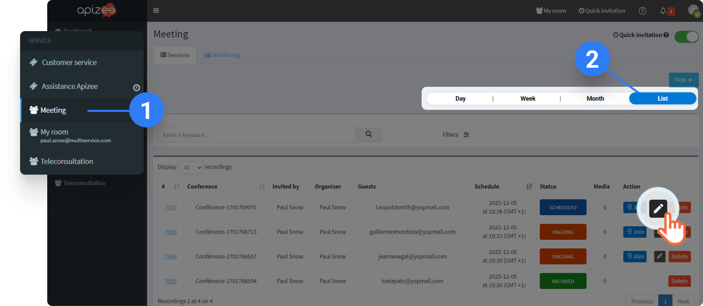
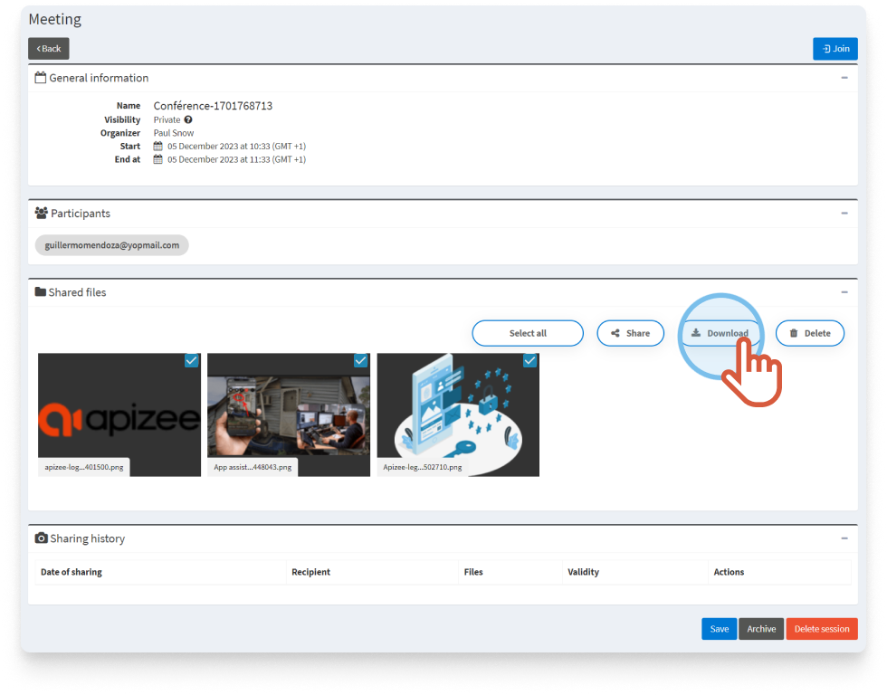

# Download files:

* [During the session](download-the-files-shared-during-the-conference.md)
* [After the session](download-the-files-shared-during-the-conference.md)
* [After the session in the portal](download-the-files-shared-during-the-conference.md)

## During the session

1. You received a notification in the **Messages**tab, click on the tab.
2. Click the **arrow** next to the image to download the file&#x20;


The file is downloaded.


## After the session


The session is over now. The end of session page opens with the shared files on the right.


1. Click the **arrow** next to the file to download it. **OR**
2. Click **Download all** to download all the files.


The files are downloaded.


If you want to, you can download those same files on another device. Interested? Click **Show more**.

\[+] [Show More](https://github.com/rvailleux/docs/tree/master/faq/meetings/users/actions-during-the-conference/share-and-download-files/javascript:void\(0\)/README.md) \[-] [Hide](https://github.com/rvailleux/docs/tree/master/faq/meetings/users/actions-during-the-conference/share-and-download-files/javascript:void\(0\)/README.md)

1. At the bottom right, click **Download on another device**.

&#x20;2\. Enter en email address and click **Confirm**.

```
|  | A new message is sent on your email address |
| --- | --- |
```

3\. From the other device, open the new message you have been sent on the email address given below. 4. Click the link in the message.

```
|  | The end of session page opens with the shared files on the right. |
| --- | --- |
```

## After the session in the portal


You are the organizer of the session from which the files are from. Or, you are an administrator. You are logged in to you account.


1. On the left-hand menu, click the service you want.
2. On the right, click **List**. That will help you find faster the session you are looking for.
3. In the list, find the session you want and click&#x20;



```
|  | The page displays. |
| --- | --- |
```

4\. Under **Shared files**, select the file you want and click **Download**.


