1. Go to the [Apizee Support Center](https://apizee.atlassian.net/servicedesk/customer/portals).

    

    You are directed to the Apizee Support Website.

    
# Create an Apizee support account

1. To create a free account, click **Sign up**.

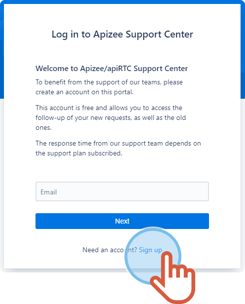
2. Enter your email address the, click **Send link**.

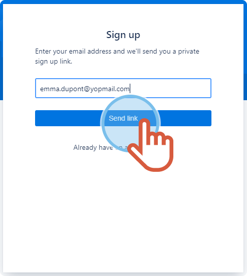
3. From your mailbox, open and click the link.
4. Enter your last name and first name, choose a password and click **Sign up**.

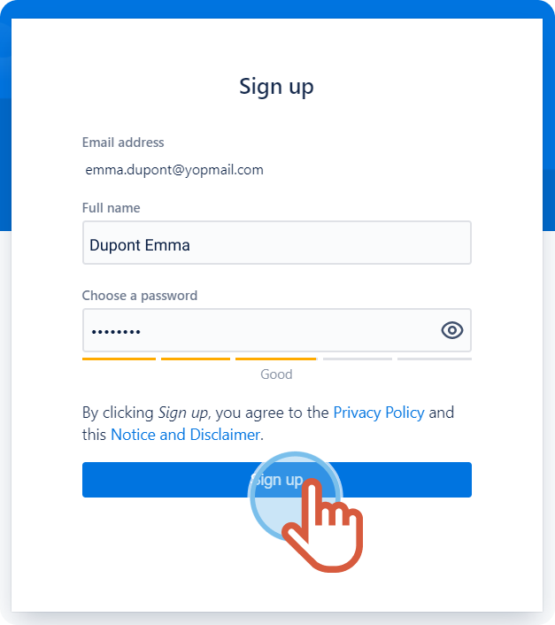


You are logged in to your Apizee Support account.


# Create a support request

1. To create a request, click **Apizee Technical Support**.

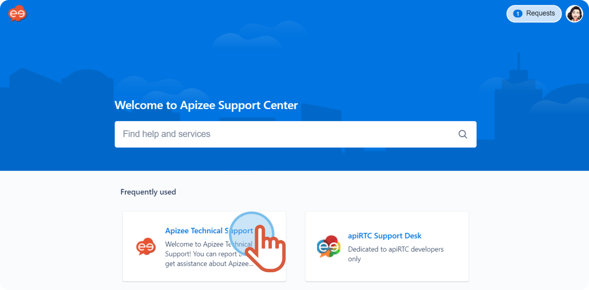
2. Choose the **product** you use.

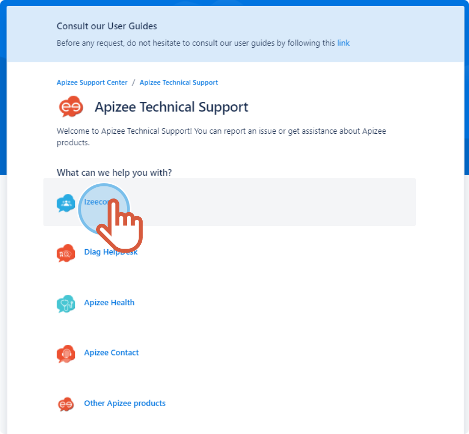
3. Enter a **summary** and a **description**.
4. If needed, add an attached file.
5. Click **Send**.​

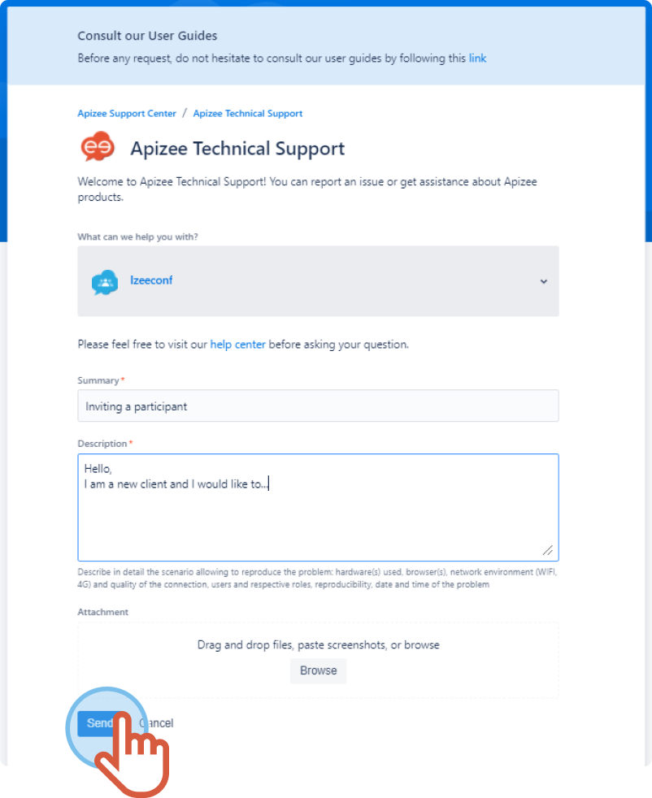


The overview of your request displays.


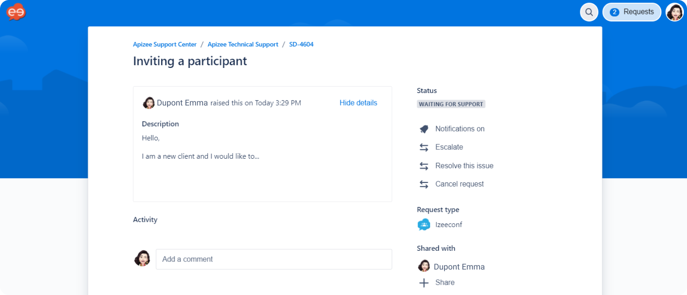

# Follow a support request

1. To follow your support request, please log in to your Apizee Support account.
    1. Enter your email address then, click **Next**.

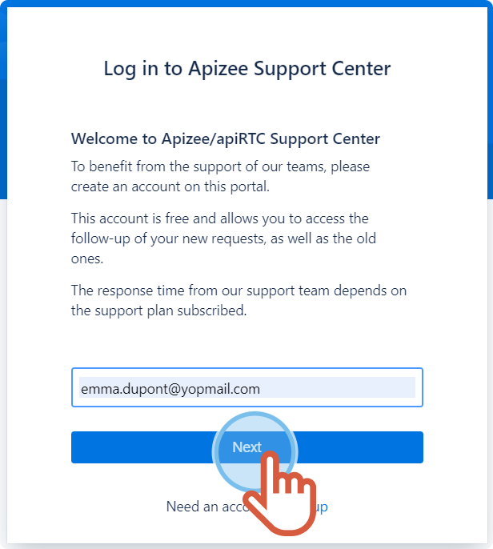
    2. Enter your password then, click **Log in**.

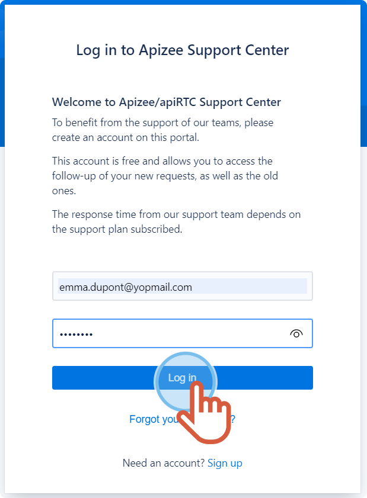
2. At the top right, click **Requests – Created by me**.

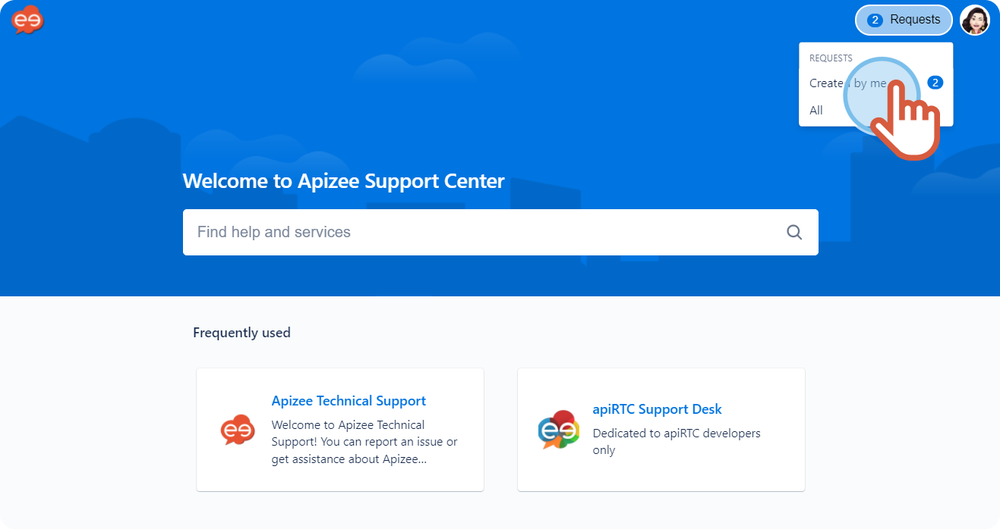
3. Find the request you want then, click it.

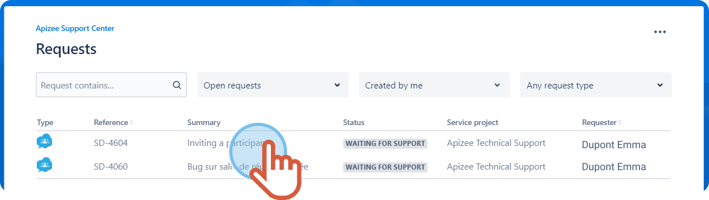


The overview of your request displays.


