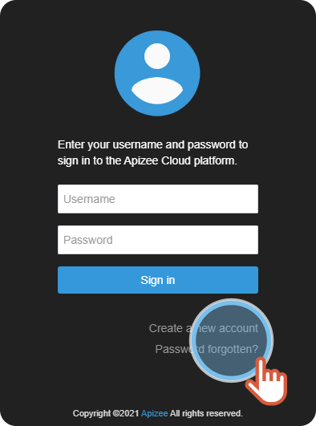


You want to log in to your account but you forgot your password.


1. On the log in page, click **Password forgotten?   **
2. Enter your login.
3. Tick the box **I'm not a robot**.
4. Click **Reset**. 

    

    An email is sent with a reset password link.

    
5. Click the link in the email.
6. Choose a new password and enter it again to confirm it. 
 
 [+] [Show More](javascript:void%280%29)
 [-] [Hide](javascript:void%280%29)
|  | Choose a **different password** that you do not use for another Website.    Mix up the characters: 12 characters, 1 uppercase, 1 lowercase, 1 digit, 1 special character.    Protect your password: Keep it in memory, change it regularly and do not save it in a file or on a piece of paper. |
    | --- | --- |
7. Click **Save**.


Your password is changed, you are logged in to your account.

