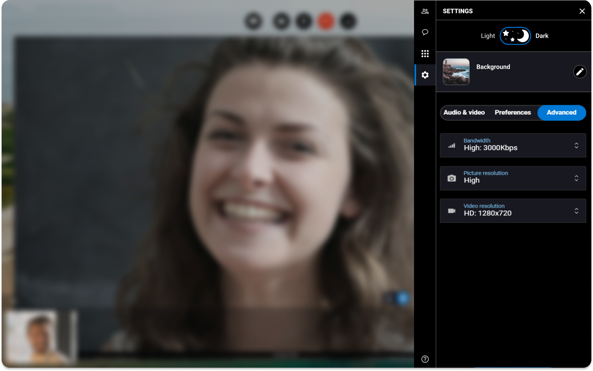

# bandwidth-resolution-settings


Even if the solution optimizes automatically the bandwidth and the resolution, you may adjust sometimes the picture and video resolution and the bandwidth to fit your needs.


1. On the right, click the **Settings tab**.
2. Click **Advanced**.
3. Choose in the drop-down menus the **bandwidth**, the **picture resolution** and the **video resolution** you want to use for the session.


The session reloads with the new settings you applied.

