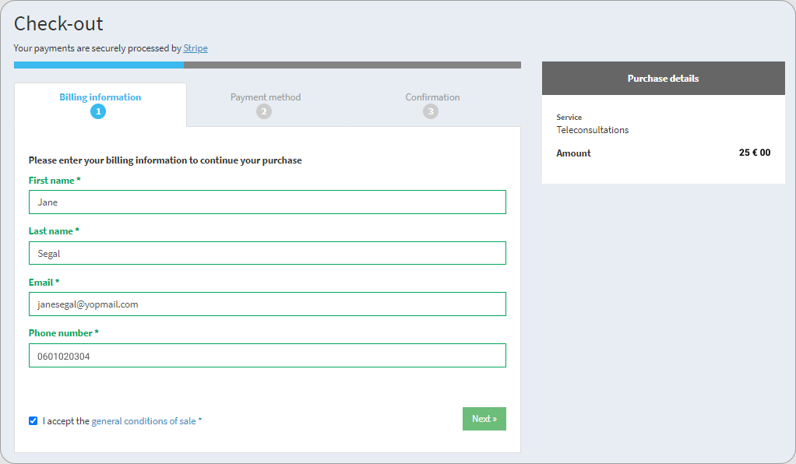
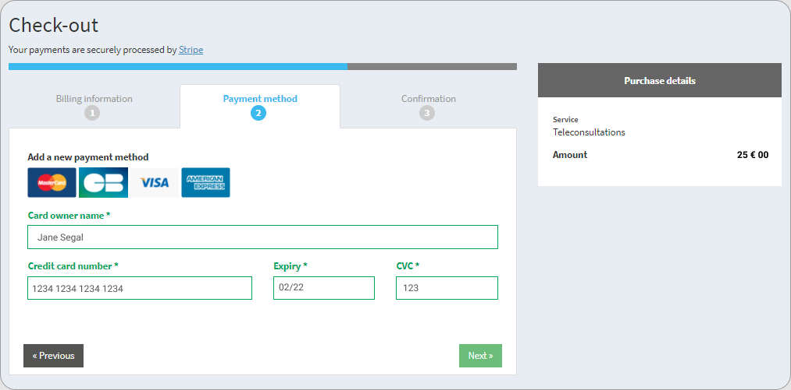
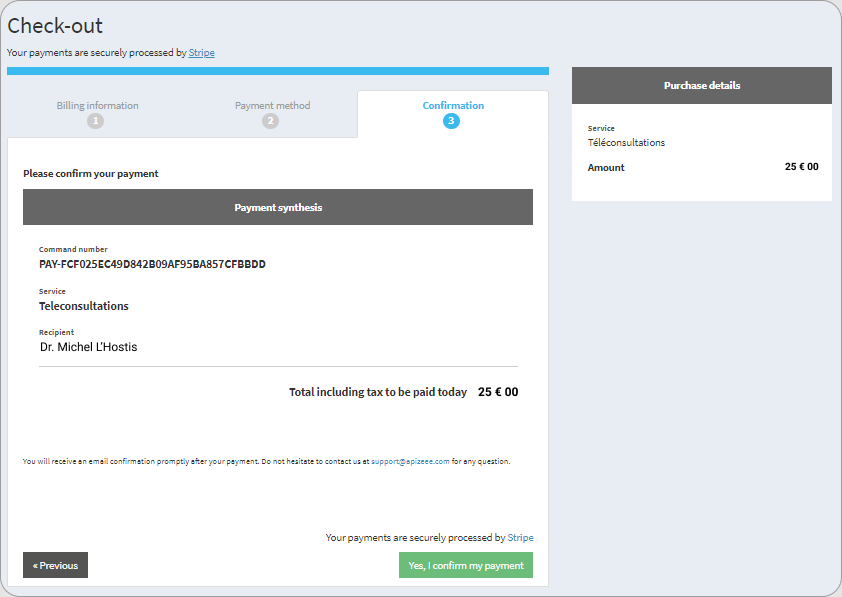

# make-a-payment-for-a-teleconsultation

There are 2 ways to pay for a teleconsultation:

* At the end of the teleconsultation, from the end of session page.
* From the message received once the teleconsultation is over.

| **From the session** | **From the message**                              |
| -------------------- | ------------------------------------------------- |
|                      | .png>) |
| ---                  | ---                                               |
| ---                  | ---                                               |
| - Click **Pay Now**. |                                                   |

\| - Click on the \*\*link \*\*to pay the amount.

|


You are directed to the payment page.


1. Fill in the information.
2. Check the box**I accept the general conditions of sale**.
3.  Click **Next**.

    .
4. Enter your credit card information.
5.  Click **Next**.

    
6.  Check the information and click **Yes, I confirm my payment**.

    


The payment is made.


***

**Watch the tutorial**

[More tutorials](../tutorials-health.md)
