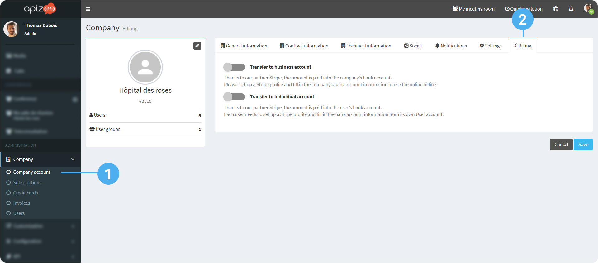
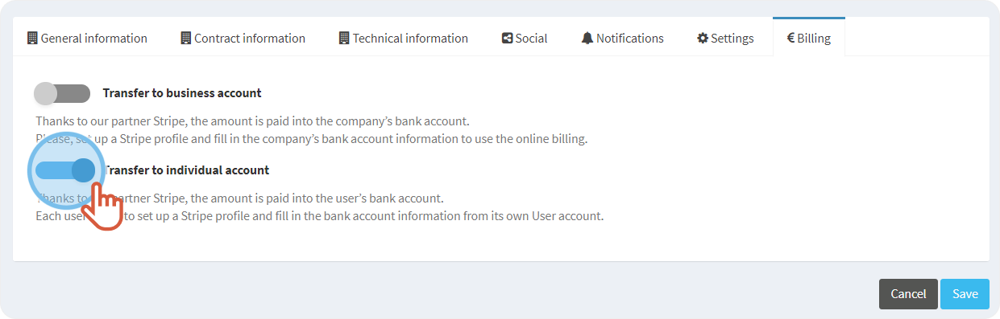

# activate-the-billing-feature


You are an administrator and you are logged in to your account.


1. On the left-hand menu, click **Company** then, **Company account**.
2. Click on the **Billing** tab.

 You may choose between 3 offers:

* Transfer to **business account**: Online payments will be made on the company or structure bank account (care home, medical center, hospital, EHPAD (long-term dependency care centre), etc.)
* Transfer to **individual account**: Online payments are directly transferred to the practitioner bank account.
* Activate the **business** & **individual** transfers: If a practitioner works for both structure and his/her own account, the practitioner will be able to choose the recipient’s bank account when he/she invoice the teleconsultation.

1. Click the **switch** button to activate the online billing you want.
2. Click **Save**.

***

**Watch the tutorial**

[More tutorials](../../tutorials-health.md)
