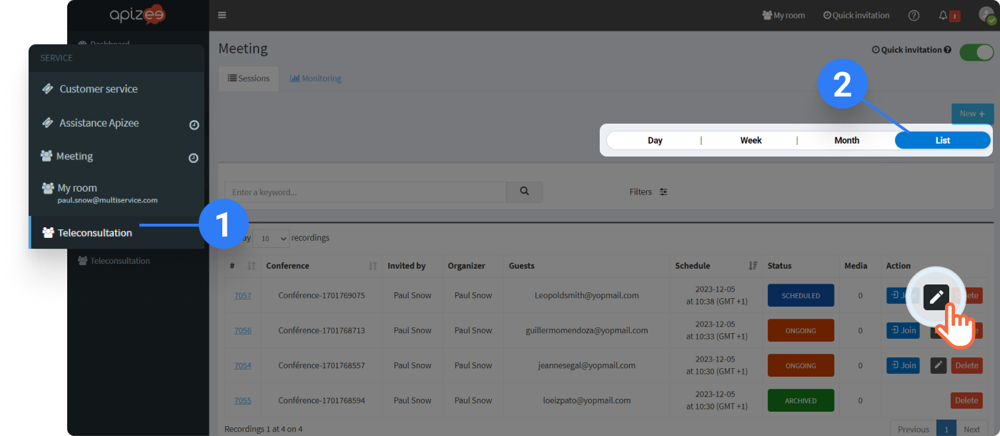

# check-the-files-information


You are the organizer of the session from which the files are from. Or, you are an administrator. You are logged in to your account.


1. In the left-hand menu, click the service you want.
2. On the right, click **List**. That will help you find faster the session you are looking for.
3. In the list, find the session you want and click&#x20;



```
|  | The page of the session displays. |
| --- | --- |
```

4\. Under **Shared files**, move your mouse over the file you are intersted in and click .

```
|  | The information display. |
| --- | --- |
```

\|  | Do no want to see the geolocation? **See also**  [Activate the geolocation](../configuration-on-the-apizee-portal/configure-the-teleconsultation/activate-the-geolocation.md) | | --- | --- |
