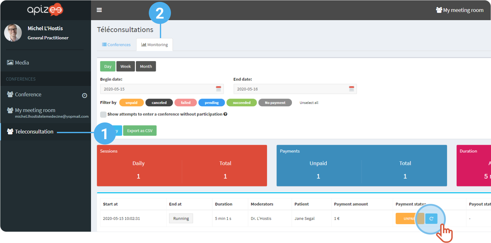

# the-patient-did-not-pay-yet-how-can-i-remind-him


You are logged in to your account.


1. From the portal, in the left-hand menu, click **Teleconsultations**.
2. Click on the **Monitoring**tab.
3. Check the line where the teleconsultation is still **Unpaid**and click the button **Send a payment reminder**. \*\*\*\* 


A reminder is sent to the patient.

