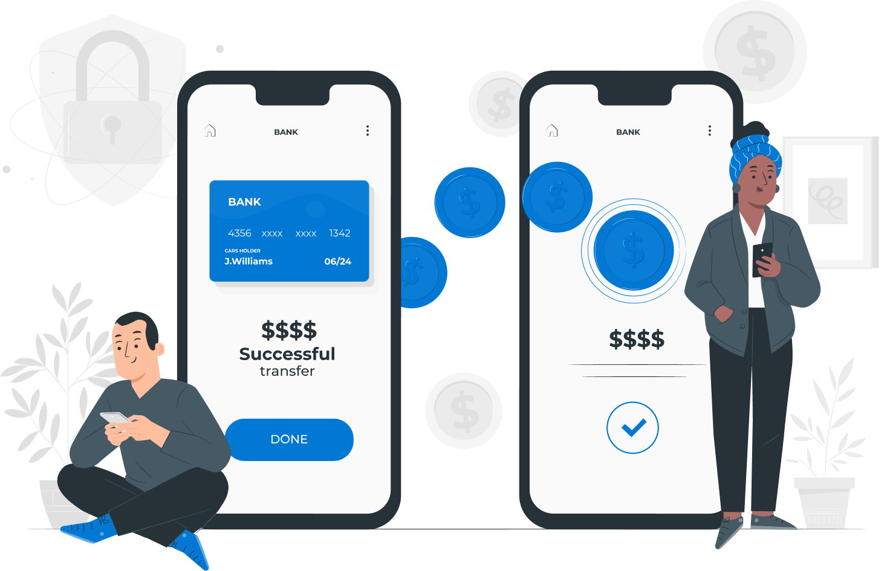

# when-will-the-patient-pay-for-the-teleconsultation

## 2 ways to pay

When the practitioner charges the teleconsultation, the patient immediately receives a message with the amount to pay and a link.

When the patient leaves the teleconsultation, a **Pay now** button displays on the end of session page.

## Withdraw and transfer

Once the payment is done:

* The patient is withdrawn immediately.
* The practitioner receives the payment the month after the teleconsultation.

