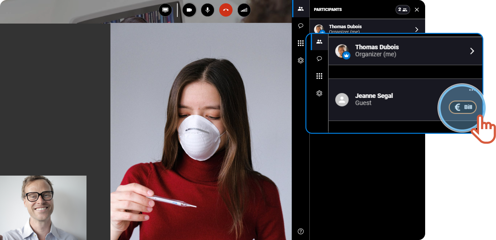
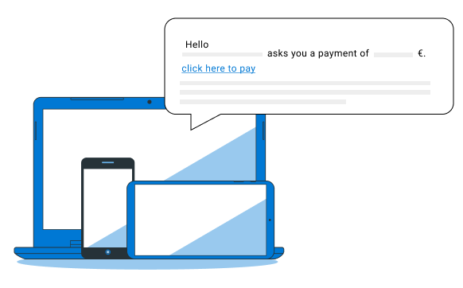

# bill-the-patient-for-the-teleconsultation


This is the end of the teleconsultation & You want to charge the teleconsultation.


1. On the right, in the **Participants**tab, click **€ Bill**.

 2. Choose or enter the amount to be paid. Minimum charge 1€. 3. Choose the receiving account of the payment in the drop-down menu.

 4. Click **Send**.


The patient receives a message with a link to proceed to the payment.



The following window displays when the patient leaves the teleconsultation, so that, the patient can directly pay for the teleconsultation.


***

**Watch the tutorial**

[More tutorials](../tutorials-health.md)
