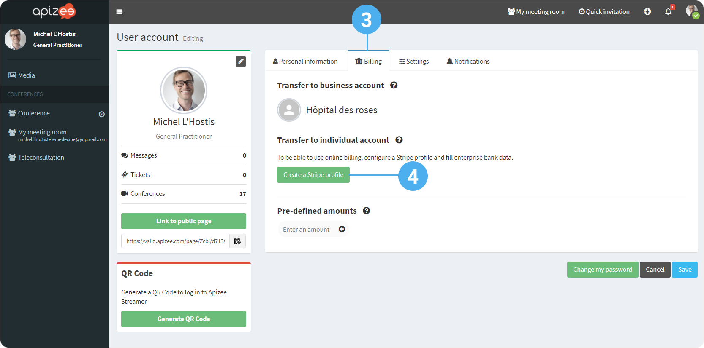
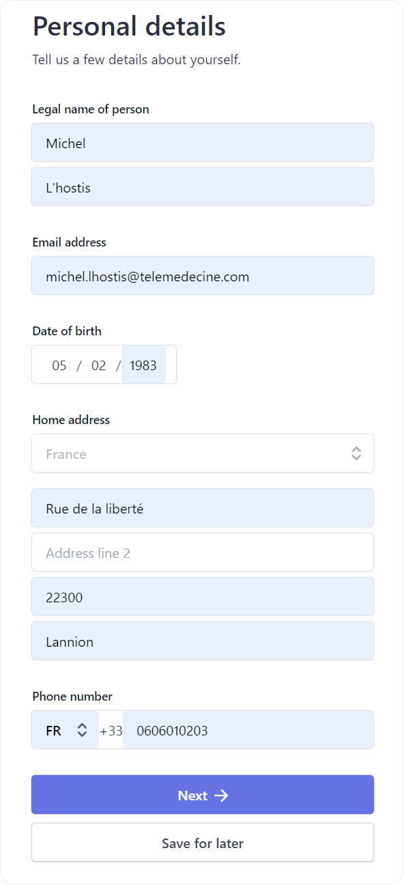
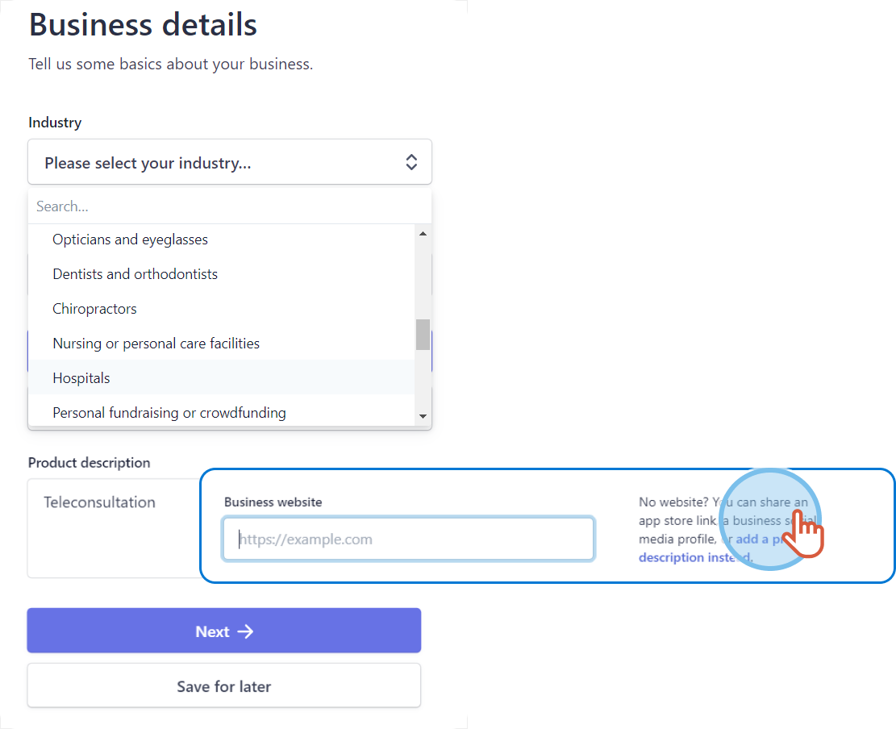
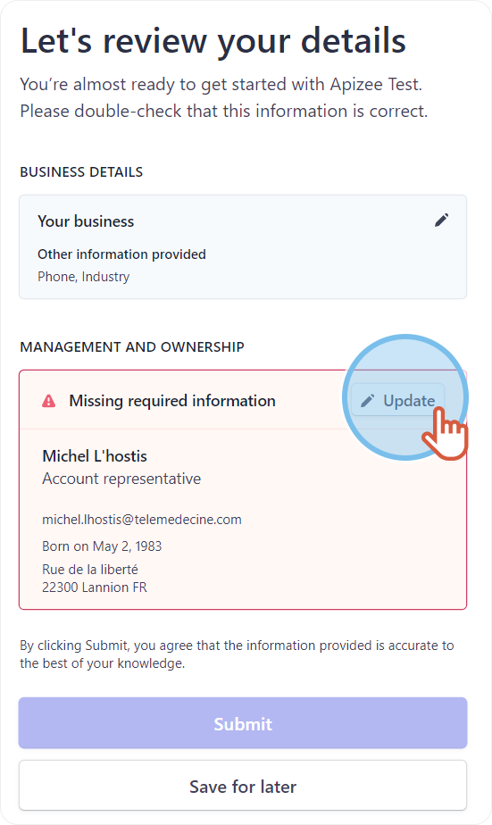
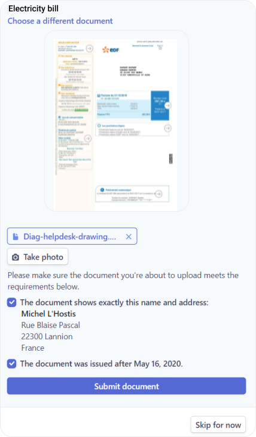
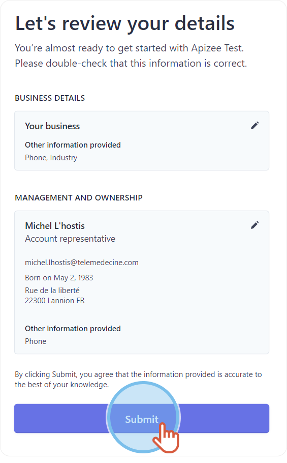
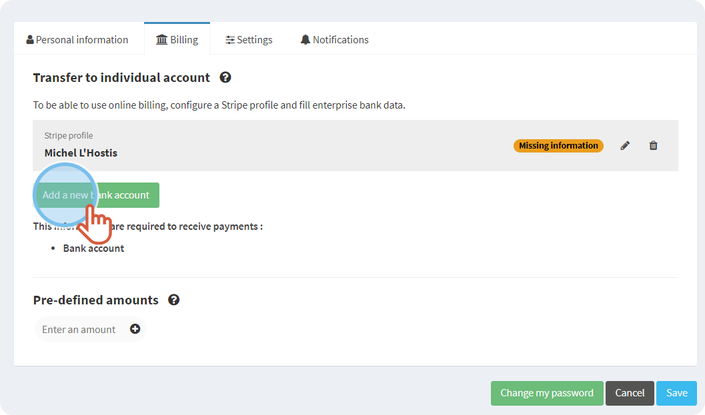
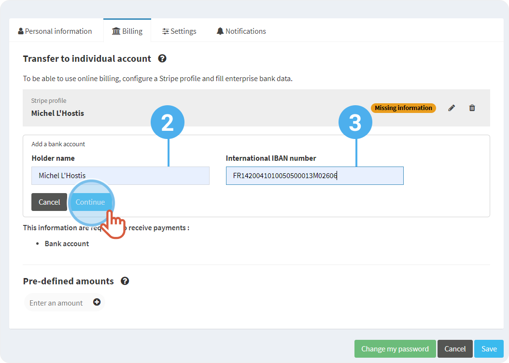
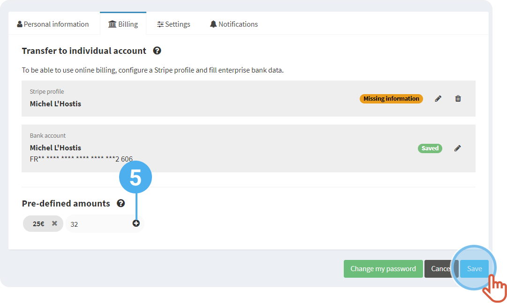

# configure-the-individual-billing


The user needs to configure a **Stripe** profile and fill in the bank account details from his/her **own** user portail to enjoy the individual payments without using the business or structure account.


## Creating a Stripe profile


Stripe is a securized payment platform. Stripe needs information to ensure the transfers between the patient account and the business account.


1. On the top right, click on your **Profile**.
2. Click **My account**.

 3. Click on the **Billing** tab. 4. Under **Transfer to an individual account**, click **Create a Stripe profile**.



```
|  | You are being directed to **Stripe** Website. |
| --- | --- |
```

### Personal information

***

1. Fill in your personal information.
2. Click **Next**.



### Business details

***

1. Choose your business **industry** in the drop-down menu.
2. If you do not have a **W\*\*\*\*ebsite**, click **Add a product description instead**.
3. Enter the medical specialty (activity) + the indication “Teleconsultation”.
4. Click **Next**.




The information is being verified


Stripe can randomly ask for more information to verify the identity of the account representative.

\[+] [Show More](https://github.com/rvailleux/docs/tree/master/faq/telehealth/practitioners/configuration-on-the-apizee-portal/activate-the-online-billing/javascript:void\(0\)/README.md) \[-] [Hide](https://github.com/rvailleux/docs/tree/master/faq/telehealth/practitioners/configuration-on-the-apizee-portal/activate-the-online-billing/javascript:void\(0\)/README.md)

### Additional information

***

1. Click **Update**.

 2. Under **ID verification**, click **Verify now**.

 3. Upload an identity document and click **Complete**.

 4. Under **Verify home address**, click **Verify now**. 5. Upload a proof of address document and click **Continue to upload**.

 6. Tick the required boxes. 7. Click **Submit documents**.

 8. Click **Done**then, **Submit**.



## Adding a bank account


You configured a Stripe profile.\
You are logged in to your account, on the **User account** page, on the **Billing** tab.


1. Click **Add a new bank account**.

 2. Enter the **holder name** of the bank account. 3. Enter the **international IBAN number** of the bank account. 4. Click **Continue**.

 5. Enter a **Pre-defined amount**. The amounts will display during the online billing as a quick entry. You will be able to choose between the different amounts or enter a new one. Minimum charge: 1€. 6. Click **Save**.




The pre-defined amounts display as follow during the online billing:



***

**Watch the tutorial**

[More tutorials](../../tutorials-health.md)
